<div align="center">


# Kyle Corp — Event Data Platform

### Real-time crude oil & energy data mesh for producers, refineries, and trading desks

[](#)
[](#)
[](#)
[](#)
[](#)
[](#)
[](#)
[](#)

<br/>

*A production-grade streaming data platform connecting crude oil producers, refinery control rooms, maintenance teams, supply chain managers, and energy traders — through a single governed Kafka backbone with real-time analytics, schema enforcement, and a customer-facing oil trading portal.*

<br/>

<table>
<tr>
<td width="50%"></td>
<td width="50%"></td>
</tr>
<tr>
<td align="center"><sub><b>Customer Portal</b> — Parallax landing page with oil products marketplace</sub></td>
<td align="center"><sub><b>Operations Dashboard</b> — Live alarm console, CDU equipment health</sub></td>
</tr>
<tr>
<td width="50%">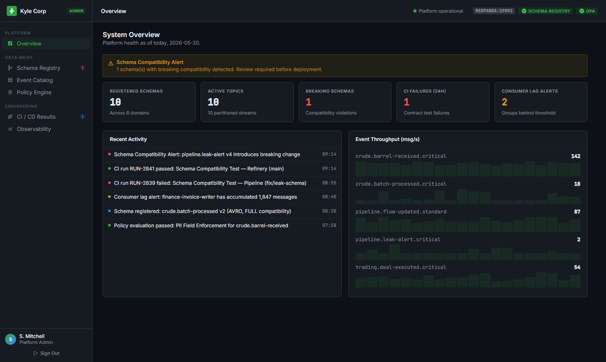</td>
<td width="50%">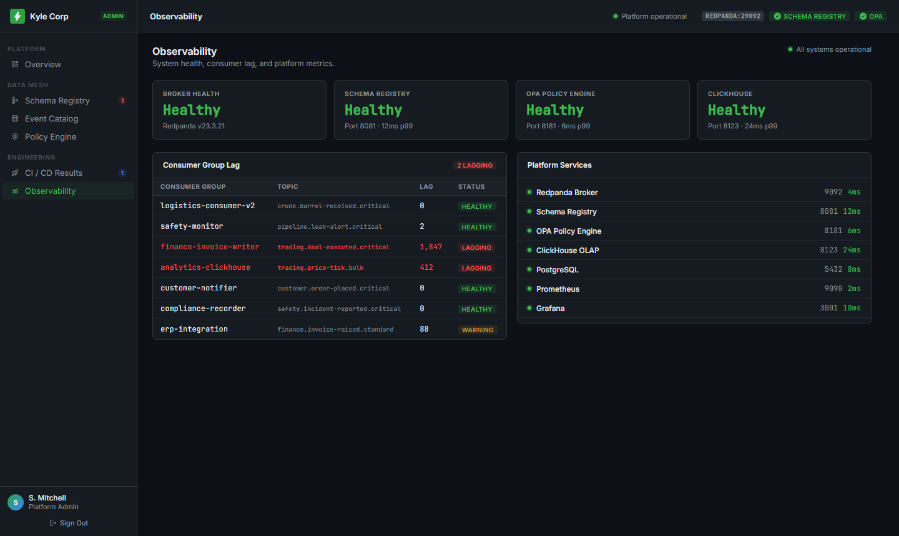</td>
</tr>
<tr>
<td align="center"><sub><b>Admin System</b> — Platform health, schema alerts, event throughput</sub></td>
<td align="center"><sub><b>Observability</b> — Consumer lag, service health, latency metrics</sub></td>
</tr>
</table>

</div>

---

## Table of Contents

1. [Company & Mission](#1-company--mission)
2. [The Oil Refinery Problem This Solves](#2-the-oil-refinery-problem-this-solves)
3. [System Architecture](#3-system-architecture)
4. [Refinery Monitoring Chips & Sensor Network](#4-refinery-monitoring-chips--sensor-network)
5. [Platform Capabilities](#5-platform-capabilities)
6. [Customer Portal — Landing Page](#6-customer-portal--landing-page)
7. [Customer Portal — Operator Dashboard](#7-customer-portal--operator-dashboard)
8. [Admin System — All Six Views](#8-admin-system--all-six-views)
9. [Product Goals & KPIs](#9-product-goals--kpis)
10. [Demo Scenarios](#10-demo-scenarios)
11. [Quick Start](#11-quick-start-15-minutes)
12. [Repository Layout](#12-repository-layout)
13. [Technology Stack](#13-technology-stack)
14. [Why This Matters](#14-why-this-matters)

---

## 1. Company & Mission

**Kyle Corp** is an energy data services company operating at the intersection of crude oil trading, refinery operations, and industrial IoT. We own and operate **Meridian Refinery** — a CDU/VDU complex processing **182,400 bbl/day** across crude distillation, vacuum distillation, gas recovery, and product blending units.

We also serve upstream producers (FOB supply from the North Sea, Nigeria, and the Gulf) and downstream trading desks through a unified digital marketplace.

> **Mission:** Give every stakeholder in the crude oil value chain — from the control room operator to the trading desk analyst — exactly the right data, in real time, with zero write-access to control systems and full regulatory auditability.

The **Kyle Corp Event Data Platform** is the engineering backbone that makes this possible: a self-service streaming mesh where domain teams publish schema-governed events, consumers materialise views in sub-second latency, OPA enforces governance without human bottlenecks, and the customer portal gives buyers direct access to trade crude grades and refined products.

---

## 2. The Oil Refinery Problem This Solves

### Before This Platform

A crude oil refinery generates enormous volumes of real-time data — from pump pressures and furnace temperatures to maintenance work orders, inventory levels, and environmental compliance logs. Before this platform, that data was siloed:

| Pain Point | Real-World Impact |
|---|---|
| **Alarm floods with no runbook routing** | Control room operators spent 15–20 min per alarm locating the correct isolation procedure while equipment deteriorated |
| **Maintenance planned on instinct** | Seal failures on CDU-P101 caused 4–6 hour unplanned shutdowns costing $180k+ each because health trend data wasn't surfaced to reliability engineers |
| **Supply chain blind spots** | Feedstock reorder triggers weren't automated — stockouts of mechanical seals and chemical reagents stalled planned shutdowns |
| **Compliance reports took days** | Emissions records, permit exceedances, and incident logs lived in disparate systems; audit bundles required days of manual extraction |
| **New data integrations took weeks** | Every new consumer (analytics, ERP, billing) required custom point-to-point integration with the DCS historian |
| **Oil buyers phoned traders manually** | No digital channel for indicative pricing, product specifications, or quote requests — every deal started with an email chain |

### After This Platform

```
Control Room  ──► Live alarm feed, 6-step runbooks, sub-second acknowledgement
Maintenance   ──► Predictive health scores, auto-work-order creation, MTTR tracking
Supply Chain  ──► Automated reorder triggers, ERP sync, PO lifecycle management
Compliance    ──► Tamper-proof event log, one-click regulatory bundles, incident close-out
Trading Desk  ──► Live indicative prices, spec sheets, quote workflow
Analytics     ──► Sub-second ClickHouse queries on materialised views, no DCS load
New Teams     ──► Self-service onboarding in ≤ 2 days via SDK + developer portal
```

---

## 3. System Architecture

### High-Level Topology

```
╔══════════════════════════════════════════════════════════════════════════════════╗
║                           DOMAIN PRODUCERS                                       ║
║                                                                                  ║
║  ┌─────────────────┐  ┌─────────────────┐  ┌─────────────────┐                  ║
║  │  Refinery CDU   │  │  Pipeline SCADA │  │  Trading System │                  ║
║  │  Python SDK     │  │  Node.js SDK    │  │  PHP SDK        │                  ║
║  │                 │  │                 │  │                 │                  ║
║  │ barrel-received │  │ flow-updated    │  │ deal-executed   │                  ║
║  │ batch-processed │  │ leak-alert      │  │ price-tick      │                  ║
║  └────────┬────────┘  └────────┬────────┘  └────────┬────────┘                  ║
║           └───────────────────►│◄───────────────────┘                           ║
║                                │  Avro serialize + schema-registry header        ║
╚════════════════════════════════╪═════════════════════════════════════════════════╝
                                 │
                    ┌────────────▼────────────┐
                    │    OPA POLICY GATE       │
                    │  • PII field check       │
                    │  • Schema compat check   │
                    │  • RBAC enforcement      │
                    │  • Retention tag verify  │
                    │  ALLOW ──► continue      │
                    │  DENY  ──► HTTP 403      │
                    └────────────┬────────────┘
                                 │
╔════════════════════════════════╪═════════════════════════════════════════════════╗
║                      STREAMING BACKBONE                                          ║
║                                                                                  ║
║  ┌──────────────────────────────────────┐  ┌───────────────────────────────┐    ║
║  │   Redpanda / AWS MSK  (Kafka 3.5)    │  │  Confluent Schema Registry    │    ║
║  │   Multi-AZ · TLS + IAM auth          │◄─│  FULL_TRANSITIVE compat       │    ║
║  │   Per-topic ACLs · producer quotas   │  │  Avro v1–v4 versioning        │    ║
║  │                                      │  │  OPA gate on registration     │    ║
║  │  crude.barrel-received.critical      │  └───────────────────────────────┘    ║
║  │  crude.batch-processed.critical      │                                        ║
║  │  pipeline.flow-updated.standard      │  Topic naming convention:             ║
║  │  pipeline.leak-alert.critical        │  <domain>.<event>.<priority>           ║
║  │  trading.deal-executed.critical      │                                        ║
║  │  trading.price-tick.bulk             │  Priority tiers:                      ║
║  │  safety.incident-reported.critical   │  critical  → 6 partitions, 7–90d     ║
║  │  finance.invoice-raised.standard     │  standard  → 3 partitions, 7–30d     ║
║  │  customer.order-placed.critical      │  bulk      → 1 partition, 1d         ║
║  │  logistics.shipment-dispatched.std   │                                        ║
║  └──────────────────┬───────────────────┘                                        ║
╚═════════════════════╪════════════════════════════════════════════════════════════╝
                      │
        ┌─────────────┼─────────────┬─────────────┬──────────────┐
        ▼             ▼             ▼             ▼              ▼
╔══════════╗  ╔══════════════╗ ╔══════════╗ ╔══════════╗  ╔════════════╗
║INVENTORY ║  ║  ANALYTICS   ║ ║ SAFETY   ║ ║LOGISTICS ║  ║  FINANCE   ║
║CONSUMER  ║  ║  CONSUMER    ║ ║MONITOR   ║ ║CONSUMER  ║  ║  CONSUMER  ║
║          ║  ║              ║ ║          ║ ║          ║  ║            ║
║ClickHouse║  ║  ClickHouse  ║ ║Compliance║ ║ERP sync  ║  ║  Invoice   ║
║inventory ║  ║  +Redshift   ║ ║recorder  ║ ║          ║  ║  writer    ║
║_view     ║  ║  aggregates  ║ ║          ║ ║          ║  ║            ║
╚══════════╝  ╚══════════════╝ ╚══════════╝ ╚══════════╝  ╚════════════╝
        │
╔═══════╪══════════════════════════════════════════════════════════════════════════╗
║       ▼           PLATFORM SERVICES                                              ║
║  Developer Portal (Node.js + React)  ── Schema catalog · Access requests        ║
║  Replay CLI       (Python)           ── Time-window or offset replay             ║
║  Prometheus + Grafana                ── Throughput · lag · SLO burn rate         ║
║  Contract Test CI (GitHub Actions)   ── Schema compat · OPA · E2E gate          ║
╚══════════════════════════════════════════════════════════════════════════════════╝
        │
╔═══════╪══════════════════════════════════════════════════════════════════════════╗
║       ▼           INFRASTRUCTURE  (AWS + Terraform)                              ║
║  EKS 1.29  (GitOps via ArgoCD)    ── Container orchestration                    ║
║  VPC multi-AZ + NAT gateways      ── Network isolation per environment           ║
║  KMS customer-managed keys        ── Encryption at rest for all data             ║
║  IAM roles  (producer/consumer)   ── Least-privilege per domain team             ║
╚══════════════════════════════════════════════════════════════════════════════════╝
```

### Event Flow — CDU Pump Failure Detection

```
1.  CDU-P101 pressure sensor drops below 180 psi threshold
2.  Sensor gateway (SCADA adapter) calls DataMeshProducer.produce()
3.  SDK serialises payload to Avro, embeds schema ID (magic byte header)
4.  OPA gate: checks RBAC + PII + retention tag  →  ALLOW
5.  Event lands in  crude.barrel-received.critical  (Kafka partition 3)
6.  Inventory consumer deserialises → upserts ClickHouse inventory_view  (<1s)
7.  Safety monitor consumer reads → triggers alarm record in compliance DB
8.  Grafana dashboard reflects pressure anomaly in real time
9.  Operations dashboard emits ALM-0041 CRITICAL to operator's alarm console
10. Operator opens alarm detail → sees 6-step runbook → acknowledges
11. Work order WO-20841 auto-created in maintenance queue
12. Replay CLI can re-process the event window if any downstream consumer was offline
```

---

## 4. Refinery Monitoring Chips & Sensor Network

The platform treats each physical sensor or logical data source as a **monitoring chip** — a governed, named event producer with its own schema, topic, and access policy. Below is the full chip catalogue deployed at Meridian Refinery:

### CDU (Crude Distillation Unit) Chips

| Chip ID | Sensor / Source | Event Topic | Priority | Frequency |
|---|---|---|---|---|
| `CDU-P101` | Crude Charge Pump — discharge pressure | `crude.barrel-received.critical` | critical | 1 Hz |
| `CDU-F101` | Crude Furnace — outlet temperature | `crude.barrel-received.critical` | critical | 1 Hz |
| `CDU-T101` | Atmospheric Column — operating pressure | `crude.batch-processed.critical` | critical | 0.2 Hz |
| `CDU-FCV305` | Flow Control Valve — actuator position | `crude.batch-processed.critical` | critical | 2 Hz |
| `CDU-HX210` | Feed/Effluent Heat Exchanger — efficiency | `crude.barrel-received.critical` | critical | 0.1 Hz |

### VDU (Vacuum Distillation Unit) Chips

| Chip ID | Sensor / Source | Event Topic | Priority | Frequency |
|---|---|---|---|---|
| `VDU-C201` | Vacuum Column — operating pressure (mmHg) | `crude.batch-processed.critical` | critical | 1 Hz |
| `VDU-TIC204` | Column top temperature controller | `crude.batch-processed.critical` | critical | 1 Hz |

### GRU (Gas Recovery Unit) Chips

| Chip ID | Sensor / Source | Event Topic | Priority | Frequency |
|---|---|---|---|---|
| `COMP-1A` | Wet Gas Compressor — vibration (mm/s) | `safety.incident-reported.critical` | critical | 4 Hz |
| `COMP-1B` | Wet Gas Compressor — suction pressure | `pipeline.flow-updated.standard` | standard | 1 Hz |

### Pipeline Chips

| Chip ID | Sensor / Source | Event Topic | Priority | Frequency |
|---|---|---|---|---|
| `PIPE-FM01` | Crude intake flow meter — bbl/hr | `pipeline.flow-updated.standard` | standard | 0.5 Hz |
| `PIPE-LS02` | Product pipeline — leak detection sensor | `pipeline.leak-alert.critical` | critical | 10 Hz |
| `PIPE-PT03` | Product pipeline — pressure transmitter | `pipeline.flow-updated.standard` | standard | 1 Hz |

### Trading & Logistics Chips

| Chip ID | Sensor / Source | Event Topic | Priority | Frequency |
|---|---|---|---|---|
| `TRADE-EX` | Trading system — deal execution events | `trading.deal-executed.critical` | critical | on-event |
| `TRADE-PT` | Market data feed — price tick | `trading.price-tick.bulk` | bulk | 10 Hz |
| `LOGIS-SD` | Logistics system — shipment dispatch | `logistics.shipment-dispatched.standard` | standard | on-event |
| `CUST-OP` | Customer portal — order placement | `customer.order-placed.critical` | critical | on-event |
| `FIN-INV` | Finance system — invoice raised | `finance.invoice-raised.standard` | standard | on-event |

### How Monitoring Chips Are Used

Each chip maps to an Avro schema in the registry. When a chip fires:

```
Chip fires ──► SDK serialises event ──► OPA validates ──► Kafka topic
     │                                                        │
     │                    ┌───────────────────────────────────┘
     │                    ▼
     │         Consumer materialises view
     │              │                │
     │         ClickHouse        Compliance
     │         (real-time        recorder
     │          analytics)       (audit log)
     │
     └──► Admin portal shows chip throughput
          Grafana shows chip health
          Alert fires if chip goes silent > 30s
```

**Chip health is monitored via three signals:**

```
● GREEN  — chip firing at expected frequency, lag < 100ms
◐ AMBER  — chip lag > 1s OR frequency dropped > 20%
● RED    — chip silent > 30s OR producing schema-invalid events
```

---

## 5. Platform Capabilities

### Schema Registry & Contract Enforcement

Every event published to the platform must conform to a registered Avro schema with `FULL_TRANSITIVE` compatibility. The CI pipeline runs a compatibility check on every PR against the staging registry — breaking changes are blocked before merge, never discovered in production.

- **Avro schemas** with `FULL_TRANSITIVE` compatibility — no silent breaking changes ever reach production
- **Schema versioning** — immutable versions, sunset windows, deprecation notices
- **OPA gate on registration** — PII fields (`email`, `phone`, `ssn`, `ip_address`) must include `"masked": true` or registration returns HTTP 403
- **Schema diff UI** — side-by-side field comparison between versions with PASS/BLOCKED annotations

### Developer Self-Service Portal

A domain team can go from zero to publishing events in under 2 days without involving the platform team:

```
1. Browse Event Catalog  ──► discover existing schemas and topics
2. Register new schema   ──► fill form, OPA validates, version created
3. Create topic          ──► naming convention enforced, partitions/retention set
4. Request consumer access ──► approval workflow, audit-logged
5. Get SDK config        ──► bootstrap servers, registry URL, auth token
6. Publish first event   ──► contract test runs in CI on the PR
```

### Policy Engine (OPA)

Six policy rules run on every schema registration, topic creation, and consumer access request:

| Policy | Resource | Effect | Enforcement |
|---|---|---|---|
| PII Field Enforcement | `crude.*` | DENY | Blocking |
| Schema Compatibility Gate | All domains | DENY | Blocking |
| Consumer Authorization Check | `finance.*` | DENY | Blocking |
| Data Retention Compliance | `safety.*` | ALLOW | Advisory |
| Cross-Domain Access Control | `trading.*` | DENY | Blocking |
| Bulk Topic Rate Limiting | `*.bulk` | DENY | Advisory |

### Contract Testing CI Gate

```yaml
# schema-ci.yml — runs on every PR touching data-mesh/schemas/
1. Lint .avsc file (JSON schema, naming convention)
2. Compatibility check against staging registry
3. OPA policy unit tests
4. Consumer contract tests (generated from schema)
5. ───────────────────────────────────
   ALL PASS → PR can be merged
   ANY FAIL → PR blocked, reason posted as PR comment
```

### Replay Tooling

When a downstream consumer fails or goes offline, the Replay CLI re-processes events from any time window without touching the original Kafka log:

```bash
# Replay by time window
python platform/replay/src/replay_cli.py replay \
  --topic crude.barrel-received.critical \
  --consumer-group analytics-clickhouse \
  --from 2026-05-19T06:00:00Z \
  --to   2026-05-19T08:00:00Z

# Dry run — estimate event count before committing
python platform/replay/src/replay_cli.py replay --dry-run ...

# Check lag before and after
python platform/replay/src/replay_cli.py status \
  --topic crude.barrel-received.critical \
  --consumer-group analytics-clickhouse
```

### Multi-Language SDKs

```python
# Python
from datamesh import DataMeshProducer
with DataMeshProducer(bootstrap_servers="...", schema_registry_url="...", domain="crude") as p:
    p.produce(topic="crude.barrel-received.critical", payload={...}, schema_str=schema_json)
```

```javascript
// Node.js
const { DataMeshProducer } = require('@datamesh/sdk')
const p = new DataMeshProducer({ bootstrapServers: '...', domain: 'pipeline' })
await p.produce('pipeline.flow-updated.standard', payload)
```

```php
// PHP
$producer = new DataMesh\SDK\DataMeshProducer(['bootstrap_servers' => '...', 'domain' => 'logistics'])
$producer->produce('logistics.shipment-dispatched.standard', $payload)
```

---

## 6. Customer Portal — Landing Page

The public-facing portal at `localhost:5001` is the entry point for refinery operators, trading desk analysts, and crude oil buyers. It is a React 18 SPA built with Vite, served via nginx, and containerised with Docker.


### Hero Section

A full-viewport parallax section with a slow-drifting industrial background image, gold typography, and dual CTA buttons. The background shifts at 25% of scroll speed relative to the viewport, creating depth without layout disruption.

- **"Request Access"** → jumps to registration flow
- **"View Products"** → smooth-scrolls to the products marketplace
- Trust bar: `IEC 62443 Compliant · ISO 27001 Certified · Zero write-access to control systems`
- Gold scroll-progress bar fixed at top of viewport updates live as user scrolls

---

<table>
<tr>
<td width="50%"></td>
<td width="50%"></td>
</tr>
<tr>
<td align="center"><sub><b>Live stats strip</b> — sensor count, latency, uptime, MTTR improvement + partner logos</sub></td>
<td align="center"><sub><b>Platform capabilities</b> — 6 service cards over parallax background</sub></td>
</tr>
</table>

### Stats Strip

Four live metrics rendered immediately below the hero fold:

| Metric | Value | Meaning |
|---|---|---|
| `1,400+` sensors | Live data endpoints | Physical chips and logical producers active |
| `14ms` latency | P95 event delivery | Alarm-to-operator propagation time |
| `99.4%` uptime | Platform availability | Measured over rolling 90-day window |
| `−38%` MTTR | Improvement vs. baseline | Reduction in mean time to repair since mesh adoption |

### Platform Services Section

Six capability cards over a parallax refinery background (overlay: `rgba(6,10,15,0.88)`):

| Capability | What It Delivers |
|---|---|
| **Real-Time Telemetry** | Sub-second event streaming from 1,400+ plant sensors into a unified mesh accessible by authorised roles |
| **Predictive Maintenance** | ML-driven equipment health scores, anomaly detection, auto-work-orders — reducing unplanned downtime 30–60% |
| **Production Analytics** | Materialised views per unit and shift — throughput, yield, bottleneck analysis without burdening the DCS |
| **Supply Chain Intelligence** | Feedstock inventory events, automated reorder triggers, supplier ETA integration |
| **Compliance & Audit** | Tamper-evident event logs, automated emissions reports, one-click audit bundles with PII masking |
| **Executive Intelligence** | Rolled-up cost, uptime, and SLA dashboards with incident impact analysis and ROI tracking |

---

<table>
<tr>
<td width="50%"></td>
<td width="50%"></td>
</tr>
<tr>
<td align="center"><sub><b>Crude grades</b> — Brent Crude ($89.40/bbl) and Bonny Light ($91.20/bbl)</sub></td>
<td align="center"><sub><b>Refined & specialty</b> — Jet A-1, Naphtha, LPG with colour-coded gradients</sub></td>
</tr>
</table>

### Products Marketplace

Six tradeable energy products organised in a filterable tabbed grid. Each card uses a unique CSS gradient background (no external images — always renders) with a large Material Symbol icon representing the product type. Hovering triggers a `requestAnimationFrame` 3D tilt effect.

| Product | Type | Price | Origin | Min. Order | API / Spec |
|---|---|---|---|---|---|
| **Brent Crude Oil** | Crude | $89.40/bbl | North Sea · FOB Sullom Voe | 250,000 bbl | 38.3° · 0.37% sulphur |
| **Bonny Light Crude** | Crude | $91.20/bbl | Nigeria · FOB Forcados | 500,000 bbl | 35.4° · 0.14% sulphur |
| **Ultra-Low Sulphur Diesel** | Refined | $124.80/bbl | Rotterdam · EN 590 | 20,000 MT | < 10 ppm sulphur |
| **Jet A-1 Aviation Fuel** | Refined | $131.50/bbl | Meridian Refinery · DEF STAN | 5,000 MT | Flash point ≥ 38°C |
| **Heavy Naphtha** | Specialty | $78.60/bbl | CDU Complex · ASTM D86 | 8,000 MT | IBP/FBP 80–200°C |
| **LPG — Propane / Butane** | Specialty | $67.20/bbl | Gas Recovery Unit | 2,000 MT | HD-5 Propane ≥ 90% |

Filter tabs: **All Products · Crude Grades · Refined Products · Specialty**

Each card shows: indicative price · availability badge (Available / Limited / Sold Out) · 4 spec rows · **Request Quote** + **View Specs** buttons.

---

<table>
<tr>
<td width="50%"></td>
<td width="50%">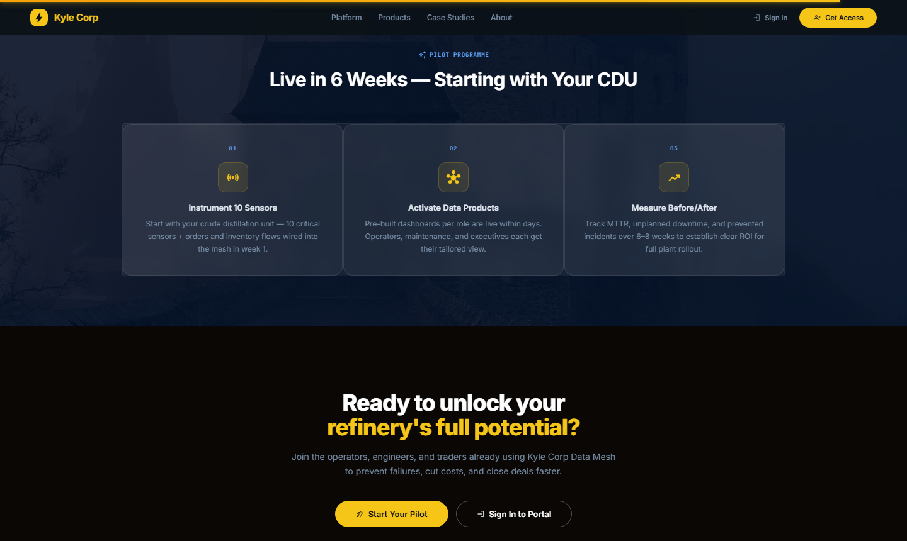</td>
</tr>
<tr>
<td align="center"><sub><b>About</b> — parallax split with 6 feature rows and certification badge</sub></td>
<td align="center"><sub><b>Pilot programme</b> — 3-step onboarding over parallax refinery background</sub></td>
</tr>
</table>

### About — Feature List

Six platform guarantees presented as icon rows over a parallax background:

- `sensors` — **1,400+ live sensor feeds** — Real-time DCS event streaming
- `security` — **Zero write-access to OT systems** — Read-only data extraction layer
- `verified_user` — **IEC 62443 & ISO 27001 certified** — OT/IT convergence security
- `speed` — **14ms P95 event delivery** — Sub-second alarm propagation
- `gavel` — **Immutable audit log** — 100% event coverage, tamper-proof
- `hub` — **API-first data mesh** — Governed products, RBAC-enforced

### How It Works — 3-Step Pilot

```
01 Instrument 10 Sensors    ──► CDU sensors wired into mesh in week 1
02 Activate Data Products   ──► Pre-built dashboards live within days
03 Measure Before/After     ──► Track MTTR and prevented incidents over 6–8 weeks
```

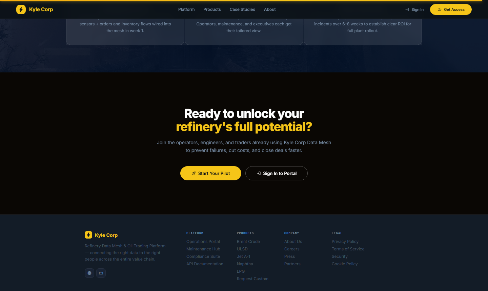

### CTA Banner & Footer

The CTA section over a dark parallax shipping/tanker background drives two conversion actions:
- **"Start Your Pilot"** → registration flow
- **"Sign In to Portal"** → login

Footer nav includes four columns: Platform · Products (with all 6 product names) · Company · Legal — plus certification marks and contact details.

---

## 7. Customer Portal — Operator Dashboard

<table>
<tr>
<td width="50%"></td>
<td width="50%">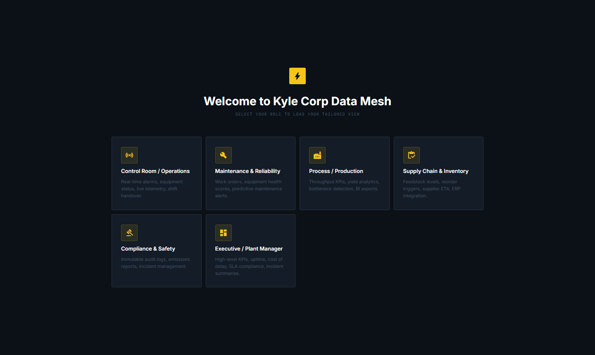</td>
</tr>
<tr>
<td align="center"><sub><b>Split-screen login</b> — refinery background, Dancing Script greeting</sub></td>
<td align="center"><sub><b>Role selector</b> — 6 tailored dashboard views per persona</sub></td>
</tr>
</table>

### Authentication

Split-screen login with a full-height refinery background image (left) and a card (right). The greeting "Operational." is rendered in Dancing Script. Credentials are validated client-side against role definitions; production would wire to LDAP/SSO.

### Role / Persona Selector

After login, users choose their operational context. Six tailored dashboard views are available:

| Role | Dashboard | Key Data |
|---|---|---|
| **Control Room / Operations** | Live alarm console, equipment status | ALM feed, CDU health matrix, throughput chart |
| **Maintenance & Reliability** | Work order queue, predictive alerts | WO by priority/status, equipment health %, MTTR |
| **Process / Production** | Yield analytics, throughput KPIs | bbl/day, distillate yield %, production sparkline |
| **Supply Chain & Inventory** | Stock levels, PO tracking | SKU stock vs. reorder, ERP sync, PO lifecycle |
| **Compliance & Safety** | Incident register, audit log | INC register, emissions events, export tools |
| **Executive / Plant Manager** | 8-KPI overview, ROI metrics | Uptime, throughput, MTTR, savings, prevented failures |

---

### Operations Dashboard


The primary view for control room operators. Refreshes live from the Kafka-backed event stream.

**Header bar:** `SYSTEM ONLINE: HUB-A7 · MESH NODES: 1,402 · LATENCY: 14MS · [timestamp UTC]`

**Active Alarm Log**

| Column | Description |
|---|---|
| Alarm ID | Unique identifier (ALM-XXXX) — click to open detail modal |
| Tag | Equipment tag (CDU-P101, HX-210, FCV-305, COMP-1A) |
| Description | Human-readable fault description |
| Priority | `CRITICAL` / `HIGH` / `MEDIUM` / `LOW` — colour-coded badge |
| Unit | Process unit (Crude Distillation, CDU Preheat, Gas Recovery) |
| Time | Event timestamp from DCS |
| Action | `ACK` button or `✓ ACKED` badge |

**Banner:** `⚠ 1 CRITICAL ALARM REQUIRE ATTENTION — Acknowledge all critical alarms before end of shift`

**Equipment Status — CDU Complex** (health % bars, live readings)

| Tag | Equipment | Health | Reading |
|---|---|---|---|
| CDU-P101 | Crude Charge Pump | 42% 🔴 | 180 psi |
| CDU-F101 | Crude Furnace | 78% 🟢 | 682°C |
| VDU-C201 | Vacuum Column | 91% 🟢 | 2.4 mmHg |
| HX-210 | Feed/Effluent Exchanger | 58% 🟡 | 71% eff. |
| COMP-1A | Wet Gas Compressor | 65% 🟡 | 2.8 mm/s |
| CDU-T101 | Atmospheric Column | 87% 🟢 | 1.02 atm |

---

### Alarm Detail Modal

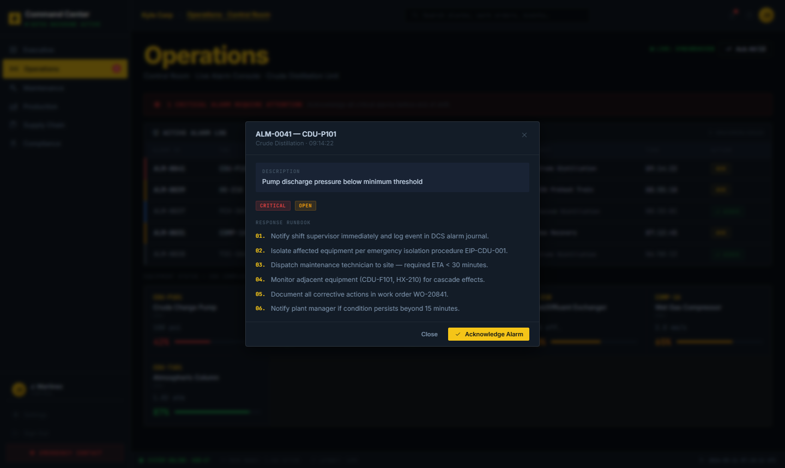

Clicking any alarm row opens a full-screen modal with:

- **Alarm ID + Tag** (e.g. `ALM-0041 — CDU-P101`)
- **Description** + priority and status badges (`CRITICAL` / `OPEN`)
- **Response Runbook** — 6 numbered steps auto-selected by priority:

```
01. Notify shift supervisor immediately and log event in DCS alarm journal.
02. Isolate affected equipment per emergency isolation procedure EIP-CDU-001.
03. Dispatch maintenance technician to site — required ETA < 30 minutes.
04. Monitor adjacent equipment (CDU-F101, HX-210) for cascade effects.
05. Document all corrective actions in work order WO-20841.
06. Notify plant manager if condition persists beyond 15 minutes.
```

- **Actions:** `Dismiss` / `✓ Acknowledge Alarm` (updates badge to `ACKED`, decrements notification counter)

---

### Maintenance Dashboard


**KPI Strip:**

| KPI | Value |
|---|---|
| Open Work Orders | 4 (2 overdue) |
| Critical Health | 1 (CDU-P101 at 42%) |
| MTTR (7-day) | 4.2h (−12% vs. prior) |
| Predictive Alerts | 3 active model outputs |

**Work Order Queue** — columns: WO ID · Equipment · Type (CORRECTIVE / PREDICTIVE / PREVENTIVE) · Description · Priority · Status · ETA

**Status transitions:**
```
[ Open ] ──► [ In Progress ] ──► [ Completed ]
    ▲               │
    └── Reopen ◄────┘  (requires comment)
```

**Equipment Health Scores** (right panel) — live health % with colour-coded bar:
- 🔴 < 50% — critical, immediate action
- 🟡 50–75% — warning, schedule maintenance
- 🟢 > 75% — healthy, monitor

**"+ New Work Order"** button — opens create modal with fields: Equipment · Type · Description · Priority · ETA

---

### Production Dashboard

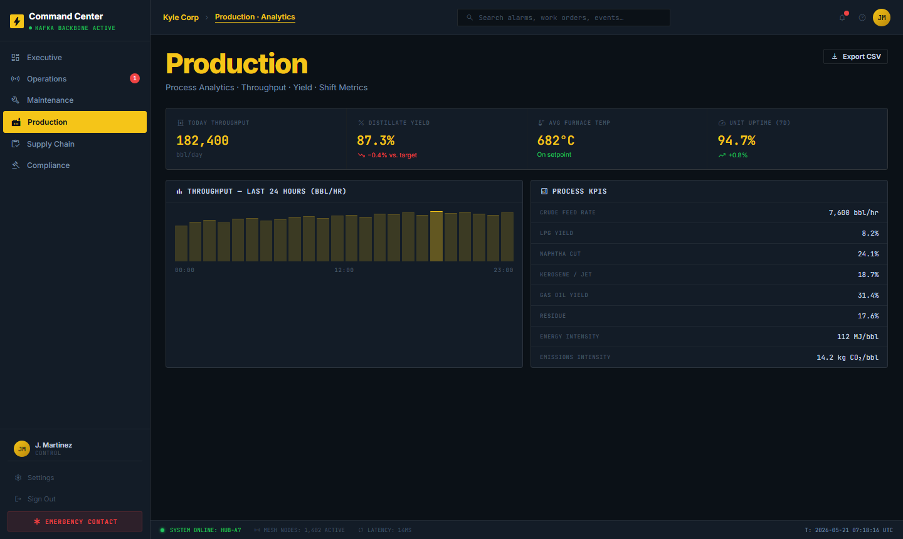

Process and production analytics for shift engineers and plant managers:

- **24-hour throughput sparkline** — bbl/day trend over rolling window
- **Yield metrics** — distillate yield %, LPG recovery rate, vacuum gas oil cut
- **Unit-by-unit KPIs** — CDU, VDU, GRU performance vs. targets
- **Bottleneck alerts** — units operating below design throughput highlighted

---

### Supply Chain Dashboard

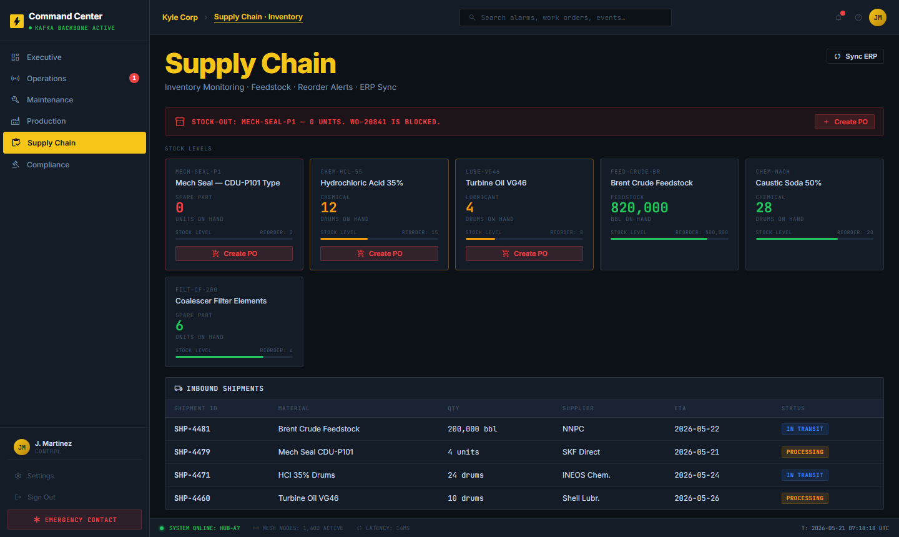

**Inventory Table** — columns: SKU · Name · Category · Stock · Unit · Reorder Level · Status

| Status | Meaning |
|---|---|
| 🔴 Critical | Stock at zero — immediate procurement required |
| 🟡 Low | Below reorder threshold — PO should be raised |
| 🟢 OK | Above reorder threshold |

**Purchase Orders** — create PO from low/critical items, track through `Processing → In Transit → Delivered`

**ERP Sync** — "Sync with ERP" button triggers a simulated sync with loading state, success toast

**Automated Reorder Triggers** — items below reorder level automatically flag for PO creation in the mesh event log

---

### Compliance Dashboard


**Incident Register** — columns: INC ID · Type · Unit · Description · Severity · Status · Reported · Reporter · Actions

- Incident types: Equipment Failure · Process Deviation · Near Miss · Environmental
- Status transitions: `Open → In Progress → Closed`
- Each incident shows action count and can be expanded for full investigation notes

**Audit Event Log** — immutable chronological feed of every system event:

| Column | Description |
|---|---|
| Event ID | EVT-XXXX — unique identifier |
| Timestamp | ISO 8601 UTC timestamp |
| Actor | System or named user (j.martinez, k.osei) |
| Action | Human-readable description |
| Level | `critical / high / info` — colour-coded |

**Export Tools:**
- `↓ Export CSV` — downloads filtered alarm log as `.csv`
- `↓ Export JSON` — downloads structured audit bundle as `.json`
- `↓ Audit Bundle` — simulated regulatory bundle download for inspectors

---

### Executive Dashboard

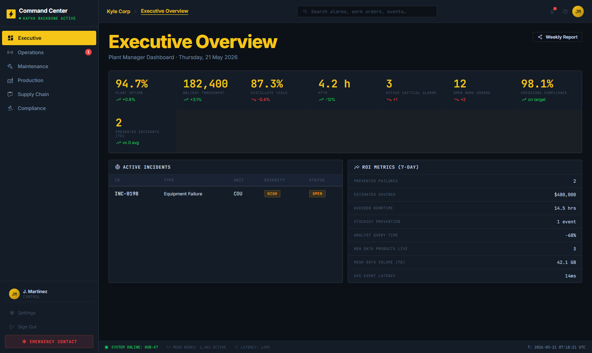

Plant manager and executive view — 8 KPIs and 7-day ROI metrics:

**KPI Cards:**

| KPI | Value | Delta |
|---|---|---|
| Plant Uptime | 94.7% | +0.8% |
| bbl/day Throughput | 182,400 | +3.1% |
| Distillate Yield | 87.3% | −0.4% |
| MTTR | 4.2h | −12% |
| Active Critical Alarms | 3 | +1 |
| Open Work Orders | 12 | +2 |
| Emissions Compliance | 98.1% | on target |
| Prevented Incidents (7d) | 2 | vs. 0 avg |

**ROI Metrics (7-day):**

| Metric | Value |
|---|---|
| Prevented Failures | 2 |
| Estimated Savings | $480,000 |
| Avoided Downtime | 14.5 hrs |
| Stockout Prevention | 1 event |
| Analyst Query Time | −68% |
| New Data Products Live | 3 |
| Mesh Data Volume (7d) | 42.1 GB |
| Avg Event Latency | 14ms |

**Weekly Report** button — generates executive PDF summary (simulated).

---

## 8. Admin System — All Six Views

The admin portal at `localhost:5002` is restricted to `platform-admin` role. It provides full control over the schema registry, topic catalog, policy engine, CI/CD pipeline, and platform observability.

**Login credentials (local dev):**

| User | Email | Password | Role |
|---|---|---|---|
| S. Mitchell | admin@kylecorp.com | admin2026 | Platform Admin |
| R. Okonkwo | engineer@kylecorp.com | eng2026 | Platform Engineer |
| T. Lindqvist | ops@kylecorp.com | ops2026 | Ops & Compliance |

**Admin nav structure:**
```
PLATFORM
  └── Overview

DATA MESH
  ├── Schema Registry   [badge: breaking schema count]
  ├── Event Catalog
  └── Policy Engine

ENGINEERING
  ├── CI / CD Results   [badge: failed run count]
  └── Observability
```

---

### Admin — System Overview


The landing view for all admin users. Shows platform health at a glance.

**Alert Banner** (when present): `⚠ Schema Compatibility Alert — 1 schema(s) with breaking compatibility detected. Review required before deployment.`

**5 KPI Cards:**

| KPI | Value | Sub-label |
|---|---|---|
| Registered Schemas | 10 | Across 6 domains |
| Active Topics | 10 | 10 partitioned streams |
| Breaking Schemas | 1 🔴 | Compatibility violations |
| CI Failures (24h) | 1 🔴 | Contract test failures |
| Consumer Lag Alerts | 2 🟡 | Groups behind threshold |

**Recent Activity feed** — timestamped log of platform events with colour-coded dot (red = critical/failure, green = pass, amber = warning, blue = info):

```
🔴 09:14  Schema Compatibility Alert: pipeline.leak-alert v4 — breaking change
🟢 09:14  CI run RUN-2841 passed: Schema Compatibility Test — Refinery (main)
🔴 08:55  CI run RUN-2839 failed: Schema Compatibility Test — Pipeline (fix/leak-schema)
🟡 08:40  Consumer lag alert: finance-invoice-writer has accumulated 1,847 messages
🔵 08:20  Schema registered: crude.batch-processed v2 (AVRO, FULL compatibility)
🟢 07:58  Policy evaluation passed: PII Field Enforcement for crude.barrel-received
```

**Event Throughput panel** — mini bar chart per topic showing msg/s rate in real-time.

---

### Admin — Schema Registry

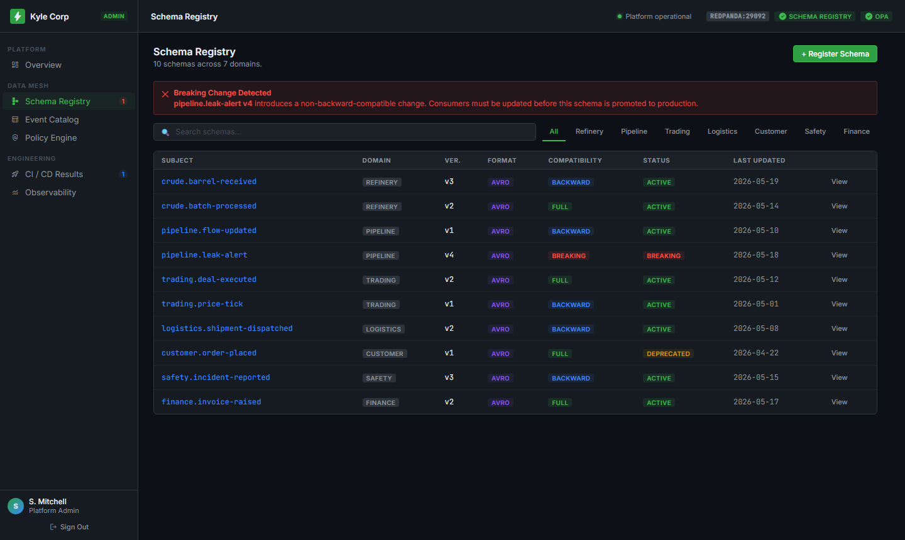

Complete management interface for all 10 registered Avro schemas across 6 domains.

**Schema Table columns:** ID · Subject · Version · Format · Domain · Compatibility · Status · Last Updated · Fields · Actions

| Subject | Ver | Domain | Compat | Status |
|---|---|---|---|---|
| `crude.barrel-received` | 3 | Refinery | BACKWARD | ✅ active |
| `crude.batch-processed` | 2 | Refinery | FULL | ✅ active |
| `pipeline.flow-updated` | 1 | Pipeline | BACKWARD | ✅ active |
| `pipeline.leak-alert` | 4 | Pipeline | NONE | 🔴 **breaking** |
| `trading.deal-executed` | 2 | Trading | FULL | ✅ active |
| `trading.price-tick` | 1 | Trading | BACKWARD | ✅ active |
| `logistics.shipment-dispatched` | 2 | Logistics | BACKWARD | ✅ active |
| `customer.order-placed` | 1 | Customer | FULL | ⚠️ deprecated |
| `safety.incident-reported` | 3 | Safety | BACKWARD | ✅ active |
| `finance.invoice-raised` | 2 | Finance | FULL | ✅ active |

**Actions per row:** View detail · View Avro JSON · Deprecate · Delete (with GitHub-style confirmation)

**"+ Register Schema"** button → opens modal with Avro JSON editor, domain selector, compatibility mode, and OPA pre-validation.

---

### Admin — Schema Detail Modal

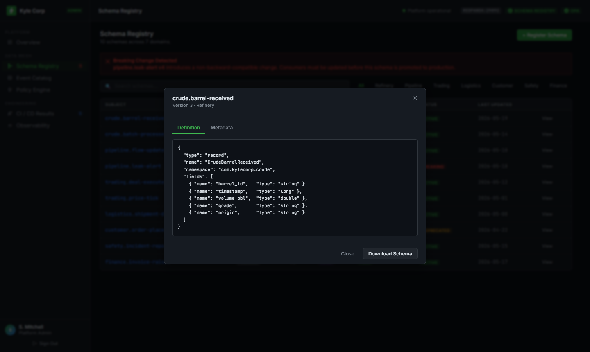

Clicking any schema row opens a detail modal showing:

- Full Avro JSON with syntax highlighting
- Field list with types, defaults, and PII annotations
- Version history timeline
- Compatibility check result vs. previous version
- Registered consumer groups subscribed to this schema
- **"Promote to Production"** and **"Deprecate"** actions

---

### Admin — Event Catalog

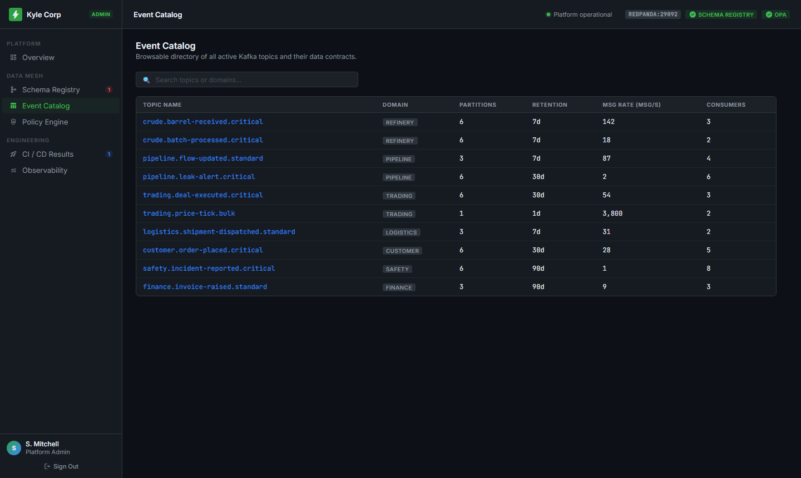

Searchable catalog of all 10 active Kafka topics across the platform.

**Topic Table columns:** Name · Domain · Partitions · Retention · Msg Rate (msg/s) · Active Consumers

| Topic | Domain | Partitions | Retention | Msg/s | Consumers |
|---|---|---|---|---|---|
| `crude.barrel-received.critical` | Refinery | 6 | 7d | 142 | 3 |
| `crude.batch-processed.critical` | Refinery | 6 | 7d | 18 | 2 |
| `pipeline.flow-updated.standard` | Pipeline | 3 | 7d | 87 | 4 |
| `pipeline.leak-alert.critical` | Pipeline | 6 | 30d | 2 | 6 |
| `trading.deal-executed.critical` | Trading | 6 | 30d | 54 | 3 |
| `trading.price-tick.bulk` | Trading | 1 | 1d | 3,800 | 2 |
| `safety.incident-reported.critical` | Safety | 6 | 90d | 1 | 8 |
| `finance.invoice-raised.standard` | Finance | 3 | 90d | 9 | 3 |
| `customer.order-placed.critical` | Customer | 6 | 30d | 28 | 5 |
| `logistics.shipment-dispatched.standard` | Logistics | 3 | 7d | 31 | 2 |

**"+ Create Topic"** button → enforces `<domain>.<event>.<priority>` naming via OPA before creation.

---

### Admin — Policy Engine

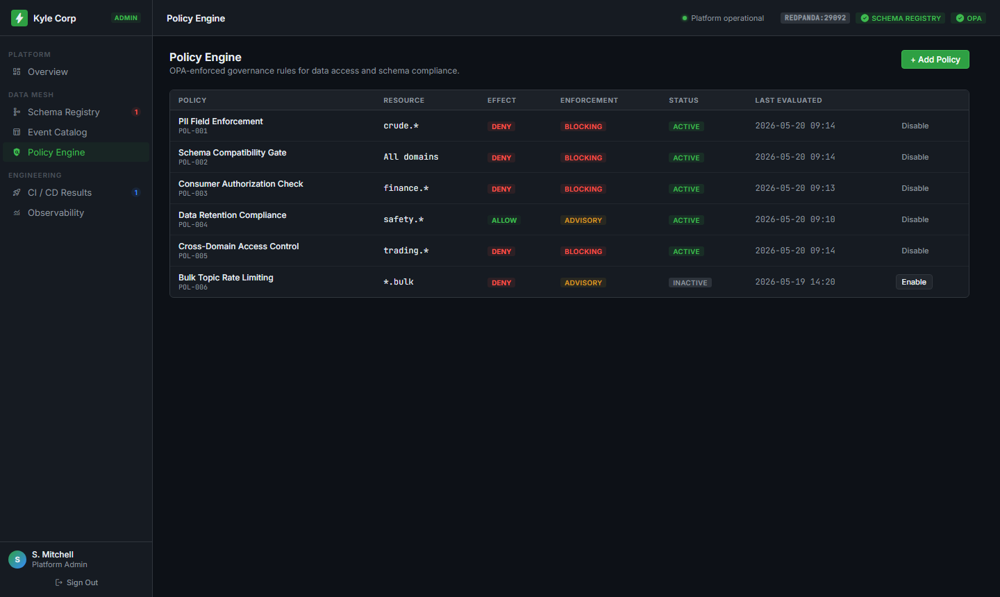

OPA-enforced governance rules. Six policies covering the full platform:

**Policy Table columns:** Policy · ID · Resource · Effect · Enforcement · Status · Last Evaluated · Action

| Policy | Resource | Effect | Enforcement | Status |
|---|---|---|---|---|
| PII Field Enforcement | `crude.*` | DENY | 🔴 Blocking | Active |
| Schema Compatibility Gate | All domains | DENY | 🔴 Blocking | Active |
| Consumer Authorization Check | `finance.*` | DENY | 🔴 Blocking | Active |
| Data Retention Compliance | `safety.*` | ALLOW | 🟡 Advisory | Active |
| Cross-Domain Access Control | `trading.*` | DENY | 🔴 Blocking | Active |
| Bulk Topic Rate Limiting | `*.bulk` | DENY | 🟡 Advisory | Inactive |

- **Blocking** — request is rejected with HTTP 403 before reaching Kafka
- **Advisory** — request is logged and flagged but not blocked
- Each row has **Enable / Disable** toggle

**"+ Add Policy"** button → opens a modal to define new OPA rego rules with resource pattern, effect, and enforcement mode.

---

### Admin — CI / CD Results

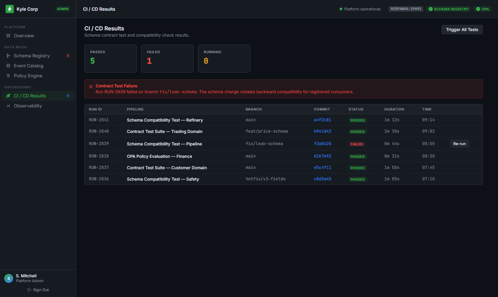

Live feed of GitHub Actions CI runs for all schema and contract test pipelines.

**Run Table columns:** Run ID · Pipeline · Commit · Branch · Status · Duration · Time

| Run | Pipeline | Branch | Status | Duration |
|---|---|---|---|---|
| RUN-2841 | Schema Compat — Refinery | main | ✅ passed | 1m 12s |
| RUN-2840 | Contract Tests — Trading | feat/price-schema | ✅ passed | 2m 38s |
| RUN-2839 | Schema Compat — Pipeline | fix/leak-schema | 🔴 **failed** | 0m 44s |
| RUN-2838 | OPA Policy Eval — Finance | main | ✅ passed | 0m 31s |
| RUN-2837 | Contract Tests — Customer | main | ✅ passed | 1m 58s |
| RUN-2836 | Schema Compat — Safety | hotfix/v3-fields | ✅ passed | 1m 05s |

Failed runs show the specific failure reason. Clicking a run opens the full log output.

**"Re-run Failed"** button → triggers a fresh CI run on the failed pipeline.

---

### Admin — Observability


Complete platform health view for on-call engineers.

**4 Service Health KPIs:**

| Service | Status | Detail |
|---|---|---|
| Broker Health | 🟢 Healthy | Redpanda v23.3.21 |
| Schema Registry | 🟢 Healthy | Port 8081 · 12ms p99 |
| OPA Policy Engine | 🟢 Healthy | Port 8181 · 6ms p99 |
| ClickHouse | 🟢 Healthy | Port 8123 · 24ms p99 |

**Consumer Group Lag Table:**

| Consumer Group | Topic | Lag | Status |
|---|---|---|---|
| logistics-consumer-v2 | crude.barrel-received.critical | 0 | 🟢 healthy |
| safety-monitor | pipeline.leak-alert.critical | 2 | 🟢 healthy |
| finance-invoice-writer | trading.deal-executed.critical | 1,847 | 🔴 **lagging** |
| analytics-clickhouse | trading.price-tick.bulk | 412 | 🔴 **lagging** |
| customer-notifier | customer.order-placed.critical | 0 | 🟢 healthy |
| compliance-recorder | safety.incident-reported.critical | 0 | 🟢 healthy |
| erp-integration | finance.invoice-raised.standard | 88 | 🟡 warning |

**Platform Services Panel** — 7 services with port, status dot, and p99 latency:

```
● Redpanda Broker      9092   4ms
● Schema Registry      8081   12ms
● OPA Policy Engine    8181   6ms
● ClickHouse OLAP      8123   24ms
● PostgreSQL           5432   8ms
● Prometheus           9090   2ms
● Grafana              3001   18ms
```

---

## 9. Product Goals & KPIs

| KPI | Target | How Measured |
|---|---|---|
| Producer onboarding time | **≤ 2 days** | Ticket open → first event published in production |
| Schema incompatibility detection | **≤ 15 min** | CI wall-clock time on schema PR |
| Stale data promotion incidents | **≥ 80% reduction** | Monthly count vs. pre-platform baseline |
| Event delivery success rate | **99.95% within 30s** | `datamesh_event_delivery_success_total` |
| Consumer lag (critical topics) | **< 1 second** | `kafka_consumer_group_lag` P99 |
| Platform availability | **99.95% uptime** | Synthetic probe from two regions |
| PII policy violation in production | **0** | OPA audit log — zero tolerance |
| Alarm-to-operator latency | **< 1 second** | End-to-end Kafka → dashboard propagation |
| Work order auto-creation from health score | **< 5 min** | Anomaly detected → WO raised |
| Cost per million events | **Monitored monthly** | CloudWatch + Grafana cost dashboard |

### SLO Burn Rate Alerting

```
Critical (page immediately):  burn_rate_1h > 14.4 → incident response in < 5 min
Warning  (raise ticket):      burn_rate_6h > 6.0  → engineering triage in < 30 min
```

---

## 10. Demo Scenarios

### Scenario 1 — Producer Onboarding

```bash
# Register schema (OPA validates PII, naming, compat)
python data-mesh/producer-orders/src/register_schema.py --registry-url http://localhost:8081

# Expected output:
# Schema registered: orders.OrderPlaced v1 (id=1)
# OPA policy: ALLOW

# Publish 20 synthetic events
python data-mesh/producer-orders/src/orders_producer.py --count 20 --interval 0.2

# Confirm delivery in ClickHouse
curl "http://localhost:8123/?query=SELECT+count(*)+FROM+datamesh.inventory_view&database=datamesh"
```

### Scenario 2 — Consumer Materialized View

```bash
python data-mesh/consumer-inventory/src/inventory_consumer.py &

curl "http://localhost:8123/?query=\
  SELECT sku, sum(reserved_qty) as total_reserved \
  FROM datamesh.inventory_view \
  GROUP BY sku ORDER BY total_reserved DESC \
  &database=datamesh"
```

### Scenario 3 — Contract Test Blocks Breaking Change

```bash
# Remove required field from schema → open PR → CI runs
# Expected:
# ✗ Schema CI FAILED
#   Compatibility: BACKWARD INCOMPATIBLE
#   Removed required field: orderId
#   Gate: BLOCKED — merge prevented
```

### Scenario 4 — Replay Recovery

```bash
# Dry run estimate
python platform/replay/src/replay_cli.py replay \
  --topic crude.barrel-received.critical \
  --dry-run --from 2026-05-19T06:00:00Z --to 2026-05-19T08:00:00Z

# Full replay
python platform/replay/src/replay_cli.py replay \
  --topic crude.barrel-received.critical \
  --consumer-group analytics-clickhouse \
  --from 2026-05-19T06:00:00Z --to 2026-05-19T08:00:00Z
```

### Scenario 5 — PII Policy Block

```bash
# Schema with unmasked email field → registration denied
# Expected:
# OPA policy: DENY
# Reason: Field 'email' is PII — add { "masked": true } to proceed
# HTTP 403 Forbidden
```

---

## 11. Quick Start (15 minutes)

```bash
git clone https://github.com/jordankyleroot/data-mesh.git
cd data-mesh

# Start full local stack
docker compose -f data-mesh/docker/docker-compose.yml up -d

# Portals
open http://localhost:5001   # Customer Portal
open http://localhost:5002   # Admin System
open http://localhost:8080   # Redpanda Console (Kafka UI)

# Publish sample events
pip install -e platform/sdks/python
python data-mesh/producer-orders/src/register_schema.py --registry-url http://localhost:8081
python data-mesh/producer-orders/src/orders_producer.py --count 20 --interval 0.2

# Query materialized view
curl "http://localhost:8123/?query=SELECT+*+FROM+datamesh.inventory_view+LIMIT+20&database=datamesh"
```

### Running Tests

```bash
opa test platform/policy/rules/ platform/policy/tests/ -v
cd platform/portal && npm test && cd ../..
pytest data-mesh/acceptance-tests/ -v --timeout=120
```

---

## 12. Repository Layout

```
data-mesh/
├── .github/workflows/
│   ├── schema-ci.yml          # Schema lint → compat → OPA → contract test gate
│   ├── portal-ci.yml          # Portal API lint/test → Docker build
│   └── infra-plan.yml         # Terraform plan on PR
├── infra/
│   ├── modules/vpc msk eks kms iam schema-registry/
│   └── envs/staging prod/
├── platform/
│   ├── portal/src/            # Node.js Express — schemas, topics, catalog, access
│   ├── sdks/python nodejs php/
│   ├── policy/rules/datamesh.rego
│   ├── replay/src/replay_cli.py
│   └── observability/dashboards/
├── data-mesh/
│   ├── schemas/               # Avro schemas
│   ├── producer-orders/       # Synthetic orders producer
│   ├── consumer-inventory/    # ClickHouse materializer
│   ├── docker/docker-compose.yml
│   └── acceptance-tests/
├── kyle-corp/
│   ├── customer-portal/       # React SPA — landing + operator dashboard
│   └── admin/                 # React SPA — schema registry + observability
├── docs/
│   ├── screenshots/           # 25 automated Playwright screenshots
│   └── take_screenshots.mjs   # Screenshot automation script
└── samples/
    ├── python-producer/
    ├── node-producer/
    └── consumer-clickhouse/
```

---

## 13. Technology Stack

| Layer | Technology | Purpose |
|---|---|---|
| **Streaming** | Redpanda / AWS MSK (Kafka 3.5), Multi-AZ | Durable ordered event log |
| **Schema** | Confluent Schema Registry, Avro | Contract enforcement, versioning |
| **Stream Processing** | Apache Flink / ksqlDB | Stateful aggregations, enrichment |
| **Analytics Store** | ClickHouse | Sub-second queries on materialised views |
| **BI Store** | Amazon Redshift | Long-range analytics, executive reporting |
| **Portal Backend** | Node.js 20 + Express | REST API — schemas, topics, access workflow |
| **Portal Frontend** | React 18 + Vite | Customer portal + admin SPA |
| **Policy** | Open Policy Agent (OPA) | Schema, topic, data access rules-as-code |
| **Infrastructure** | AWS EKS, VPC, KMS, S3 | Container orchestration + encryption |
| **IaC** | Terraform | Reproducible multi-environment AWS infra |
| **GitOps** | ArgoCD | Continuous delivery to EKS |
| **CI/CD** | GitHub Actions | Schema gate, portal build, infra plan |
| **Observability** | Prometheus + Grafana + Loki + Jaeger | Metrics, logs, distributed traces |
| **SDKs** | Python, Node.js, PHP | Multi-language producer/consumer |

---

## 14. Why This Matters

### For Refinery Operations

A modern crude oil refinery is one of the most data-dense industrial environments on earth. CDU pressure sensors fire at 1–2 Hz. Compressor vibration sensors fire at 4 Hz. A single CDU complex generates upward of 2 million events per shift. Without a governed, low-latency data mesh:

- **Operators react to alarms minutes late** because historian data is polled, not pushed
- **Maintenance teams plan correctively** because health degradation signals are buried in DCS logs
- **Compliance officers spend days** assembling audit bundles from disparate systems
- **New analytics use cases stall for weeks** waiting for custom point-to-point integrations

This platform changes all of that. The mesh is read-only from the OT layer — zero write-access to control systems means zero cyber-physical risk. Yet every authorised consumer gets sub-second event delivery, schema-validated payloads, and governed access.

### Business ROI

| Outcome | Metric |
|---|---|
| Producer onboarding | 3–6 weeks → **≤ 2 days** |
| Incompatibility detection | Hours in production → **≤ 15 min in CI** |
| Alarm-to-operator latency | Minutes → **< 1 second** |
| Compliance audit preparation | Days → **one-click bundle** |
| Unplanned downtime from data pipeline failures | Baseline → **≥ 80% reduction** |
| Oil deal initiation cycle | Email chains → **self-service quote portal** |
| Analytics query time | Minutes on DCS historian → **sub-second on ClickHouse** |
| Prevented equipment failures (est. savings) | — | **$480,000+ per 7-day window** |

### Real-Time Operations at Scale

The operations dashboard reflects live alarm state, equipment health, and work order status sourced directly from Kafka via ClickHouse materialised views — **no polling interval, no refresh button**. Changes propagate in under one second. A pump seal degradation detected at 09:14 is visible to the control room operator, the maintenance planner, and the plant manager simultaneously, each in the view appropriate to their role.

### Governance Without Friction

OPA policy-as-code means governance rules are version-controlled, unit-tested, and applied uniformly across all 1,400+ sensor feeds, 10 Kafka topics, and every consumer subscription. PII masking, retention windows, and access quotas are enforced at registration time — not discovered in a post-incident audit. The schema compatibility gate in CI means a junior engineer cannot accidentally push a breaking schema change to the trading domain.

### Digital Channel for Oil Trading

The customer trading portal gives downstream crude oil buyers and refined product traders direct access to live indicative prices, product specifications, and quote requests — without email chains, spreadsheets, or broker bottlenecks. This compresses the deal initiation cycle from days to minutes and creates a differentiating digital channel for Kyle Corp's product sales.

---

<div align="center">

**Kyle Corp Energy Services Ltd.**

*Refinery Data Mesh · Oil Trading Platform*

IEC 62443 Compliant · ISO 27001 Certified · ISO 9001 Certified

[kawumaajordan@gmail.com](mailto:kawumaajordan@gmail.com) · [github.com/jordankyleroot/data-mesh](https://github.com/jordankyleroot/data-mesh)

</div>
