<div align="center">


# Kyle Corp — Event Data Platform

**Real-time crude oil & energy data mesh for producers, refineries, and trading desks**

[](https://github.com)
[](https://github.com)
[](https://github.com)
[](https://github.com)
[](https://github.com)
[](https://github.com)

<br />

*A production-grade streaming data platform that connects crude oil producers, refinery operators, and energy traders through a governed, schema-enforced Kafka backbone — with full self-service onboarding, real-time analytics, and a customer-facing trading portal.*

<br />

<table>
<tr>
<td>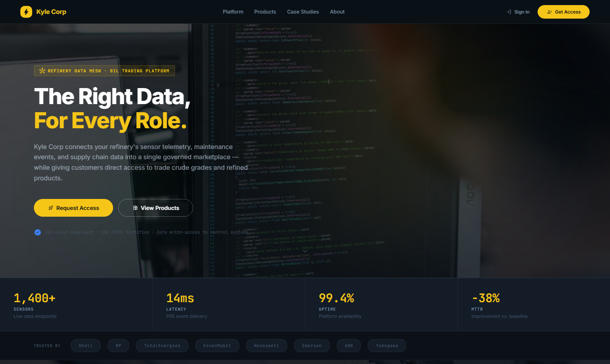</td>
<td>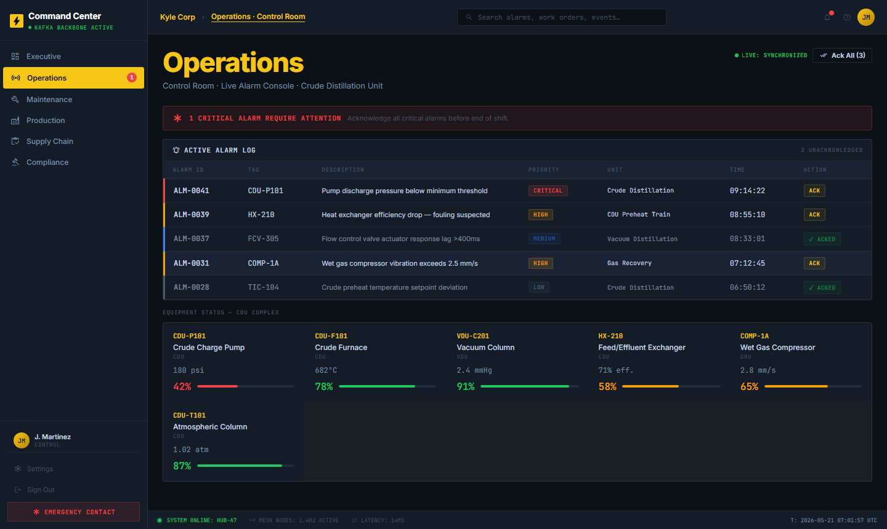</td>
</tr>
<tr>
<td align="center"><sub>Customer Portal — Landing Page</sub></td>
<td align="center"><sub>Operator Dashboard — Live Alarm Console</sub></td>
</tr>
</table>

</div>

---

## Table of Contents

1. [Company & Mission](#1-company--mission)
2. [What It Solves](#2-what-it-solves)
3. [Architecture](#3-architecture)
4. [Platform Capabilities](#4-platform-capabilities)
5. [Product Goals & KPIs](#5-product-goals--kpis)
6. [Customer Portal](#6-customer-portal)
7. [Admin System](#7-admin-system)
8. [Demo Scenarios](#8-demo-scenarios)
9. [Quick Start](#9-quick-start-15-minutes)
10. [Repository Layout](#10-repository-layout)
11. [Technology Stack](#11-technology-stack)
12. [Why This Matters](#12-why-this-matters)

---

## 1. Company & Mission

**Kyle Corp** is an energy data services company operating at the intersection of crude oil trading, refinery operations, and industrial IoT.

We run **Meridian Refinery** — a CDU/VDU complex processing 182,400 bbl/day across multiple product streams — and serve upstream producers and downstream trading desks through a unified data marketplace.

> **Mission:** Give every stakeholder in the crude oil value chain — operators, engineers, compliance officers, and traders — exactly the right data, in real time, with zero write-access to control systems.

The **Kyle Corp Event Data Platform** is the engineering backbone that makes this possible: a self-service streaming mesh where domain teams publish schema-governed events, consumers materialize views in sub-second latency, and the policy engine enforces data contracts, RBAC, and PII rules without any central bottleneck.

---

## 2. What It Solves

Before this platform, domain teams faced three compounding problems:

| Problem | Impact |
|---|---|
| Ad-hoc integrations between refinery systems, ERP, and trading desks | Weeks of custom work per integration; schema drift caused silent data corruption |
| No shared governance for who can publish or consume sensitive operational data | PII leaks, uncontrolled topic proliferation, no audit trail |
| Reactive incident response — dashboards updated minutes after events | Missed SLA windows, delayed alarm acknowledgements, manual reconciliation |

Kyle Corp's platform replaces all of this with:

- **Schema-first contracts** — every event is Avro-serialised against a versioned, compatibility-checked registry
- **Policy-as-code** — OPA rules gate schema registration, topic creation, and consumer access
- **Self-service onboarding** — a producer can be live in ≤ 2 days using the SDK and developer portal
- **Real-time materialized views** — ClickHouse views update in under 1 second; analysts query without touching Kafka
- **Customer trading portal** — downstream buyers browse live crude grades, request quotes, and track orders in a dedicated web portal

---

## 3. Architecture

```
╔══════════════════════════════════════════════════════════════════════════════╗
║                          DOMAIN PRODUCERS                                    ║
║                                                                              ║
║   Orders Domain       Refinery Sensors       Inventory Domain                ║
║   Python SDK  ──►     Node.js SDK    ──►     PHP SDK         ──►             ║
║        │                   │                      │                          ║
║        └───────────────────┼──────────────────────┘                          ║
║                            │  Avro + Schema-Registry header                  ║
╚════════════════════════════╪═════════════════════════════════════════════════╝
                             │
                             ▼
╔══════════════════════════════════════════════════════════════════════════════╗
║                       STREAMING BACKBONE                                     ║
║                                                                              ║
║   ┌──────────────────────────────┐    ┌──────────────────────────────┐       ║
║   │   AWS MSK  (Kafka 3.5)       │    │  Confluent Schema Registry   │       ║
║   │   Multi-AZ · TLS + IAM auth  │◄───│  FULL_TRANSITIVE compat      │       ║
║   │   Per-topic ACLs + quotas    │    │  OPA gate on registration    │       ║
║   └──────────────┬───────────────┘    └──────────────────────────────┘       ║
║                  │                                                            ║
║   Topics:  orders.order-placed.critical                                      ║
║            refinery.sensor-reading.high                                      ║
║            inventory.stock-updated.standard                                  ║
╚══════════════════╪═══════════════════════════════════════════════════════════╝
                   │
        ┌──────────┴──────────┐
        ▼                     ▼
╔════════════════╗   ╔═════════════════════════════════════════════════════════╗
║  POLICY ENGINE ║   ║                CONSUMERS & VIEWS                        ║
║                ║   ║                                                         ║
║  OPA Rules:    ║   ║  Inventory Service  ──►  ClickHouse  (inventory_view)  ║
║  · RBAC        ║   ║  Analytics Service  ──►  Redshift    (aggregated facts)║
║  · PII masking ║   ║  Search Service     ──►  Elasticsearch (catalog)       ║
║  · Retention   ║   ║  Alarm Service      ──►  Grafana     (live dashboards) ║
║  · Quotas      ║   ║                                                         ║
╚════════════════╝   ╚═════════════════════════════════════════════════════════╝
                                        │
╔═══════════════════════════════════════╪═════════════════════════════════════╗
║                    PLATFORM SERVICES  │                                      ║
║                                       ▼                                      ║
║  Developer Portal  (Node.js + React)  ─── Schema catalog · Access requests  ║
║  Replay CLI        (Python)           ─── Time-window or offset replay       ║
║  Prometheus + Grafana                 ─── Throughput · lag · SLO dashboards  ║
║  Contract Test CI  (GitHub Actions)   ─── Schema compat · OPA · E2E gate    ║
╚═════════════════════════════════════════════════════════════════════════════╝
                                        │
╔═══════════════════════════════════════╪═════════════════════════════════════╗
║                 INFRASTRUCTURE        │                                      ║
║                                       ▼                                      ║
║  AWS EKS (GitOps via ArgoCD)      ─── Container orchestration               ║
║  VPC multi-AZ + NAT gateways      ─── Network isolation                     ║
║  KMS customer-managed keys        ─── Encryption at rest                    ║
║  IAM roles (producer/consumer)    ─── Least-privilege access                ║
║  Terraform modules                ─── Reproducible environments             ║
╚═════════════════════════════════════════════════════════════════════════════╝
```

### Data Flow — Order Placed Event

```
1. Producer calls p.produce("orders.order-placed.critical", payload)
2. SDK serialises payload to Avro, embeds schema ID in magic byte header
3. Kafka ACL validates producer identity (IAM role: producer/orders)
4. OPA policy checks PII fields, retention tag, topic quota
5. Event lands in MSK partition with at-least-once delivery guarantee
6. Inventory consumer deserialises, upserts to ClickHouse inventory_view
7. Grafana dashboard reflects updated stock within < 1 second
8. Alarm service emits notification if stock drops below reorder threshold
```

---

## 4. Platform Capabilities

### Schema Registry & Governance

- Avro schemas with `FULL_TRANSITIVE` compatibility — no silent breaking changes
- CI pipeline runs compatibility check on every PR against the staging registry
- OPA gate blocks registration if PII fields lack `masked: true` annotation
- Schema versions are immutable; deprecation follows a sunset window policy

### Developer Portal

- Self-service UI for schema browsing, topic discovery, and access requests
- Producer onboarding wizard: schema → topic → SDK config → test publish
- Consumer catalog: filterable by domain, data classification, and SLA tier
- Access request workflow with approval routing and audit log

### Contract Testing

- Consumer-driven contract tests generated from `.avsc` schemas
- GitHub Actions gate: incompatible schema changes are blocked before merge
- Test matrix covers forward, backward, and full transitive scenarios

### Policy Engine (OPA)

- Rules for: schema registration, topic creation, consumer access, data retention
- PII detection: fields matching `email`, `phone`, `ssn`, `ip_address`, `dob` require masking
- Topic naming convention enforcement (`<domain>.<event>.<priority>`)
- RBAC with three roles: `producer`, `consumer`, `platform-admin`

### Observability Stack

- **Prometheus** scrapes producer throughput, consumer lag, schema registry latency
- **Grafana** dashboards: Refinery Operations · Producer Health · Consumer Lag · SLO Burn Rate
- **Loki** for structured log aggregation across all services
- **Jaeger** for distributed tracing across producer → Kafka → consumer paths

### Replay Tooling

- Replay by time window: `--from 2025-01-01T00:00:00Z --to 2025-01-02T00:00:00Z`
- Replay by offset: `--from-offset 0 --to-offset 50000`
- Consumer group lag status before and after replay
- Dry-run mode estimates event count without publishing

---

## 5. Product Goals & KPIs

| KPI | Target | How It's Measured |
|---|---|---|
| Producer onboarding time | **≤ 2 days** | Ticket open → first event published in production |
| Schema incompatibility detection | **≤ 15 min** | CI wall-clock time on a schema PR |
| Stale data promotion incidents | **≥ 80% reduction** | Monthly incident count vs. pre-platform baseline |
| Event delivery success rate | **99.95% within 30s** | `datamesh_event_delivery_success_total` |
| Consumer lag (critical topics) | **< 1 second** | `kafka_consumer_group_lag` P99 |
| Platform availability | **99.95% uptime** | Synthetic probe from two regions |
| PII policy violation rate | **0 in production** | OPA audit log — zero tolerance |
| Cost per million events | **Monitored monthly** | CloudWatch + Grafana cost dashboard |

### SLO Burn Rate Alerting

```
Critical (page):  burn_rate_1h > 14.4  → incident response in 5 min
Warning (ticket): burn_rate_6h > 6.0   → engineering triage in 30 min
```

---

## 6. Customer Portal

The customer-facing portal (`kyle-corp/customer-portal`) is a React single-page application served from `localhost:5001` (Docker) or `portal.kylecorp.energy` (production). It targets refinery operators, trading desk analysts, and supply chain managers.

### Landing Page

The public landing page introduces Kyle Corp's data mesh platform and product trading capabilities:

<table>
<tr>
<td></td>
<td>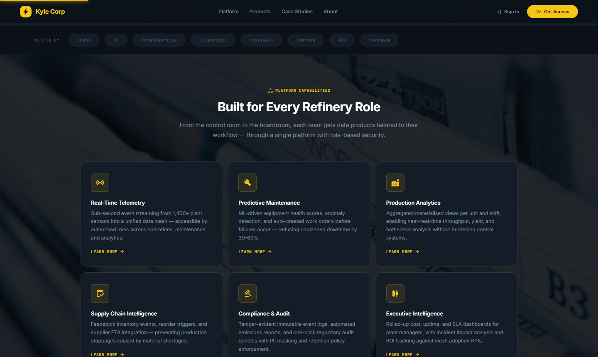</td>
</tr>
<tr>
<td align="center"><sub>Hero — parallax background, dual CTA</sub></td>
<td align="center"><sub>Live stats strip + trusted partner logos</sub></td>
</tr>
<tr>
<td>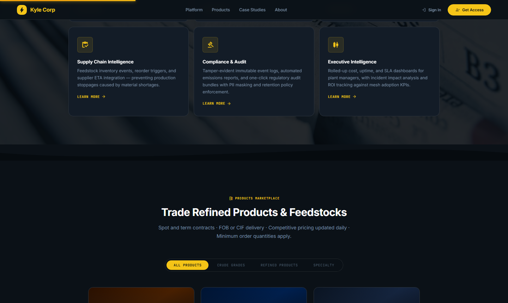</td>
<td>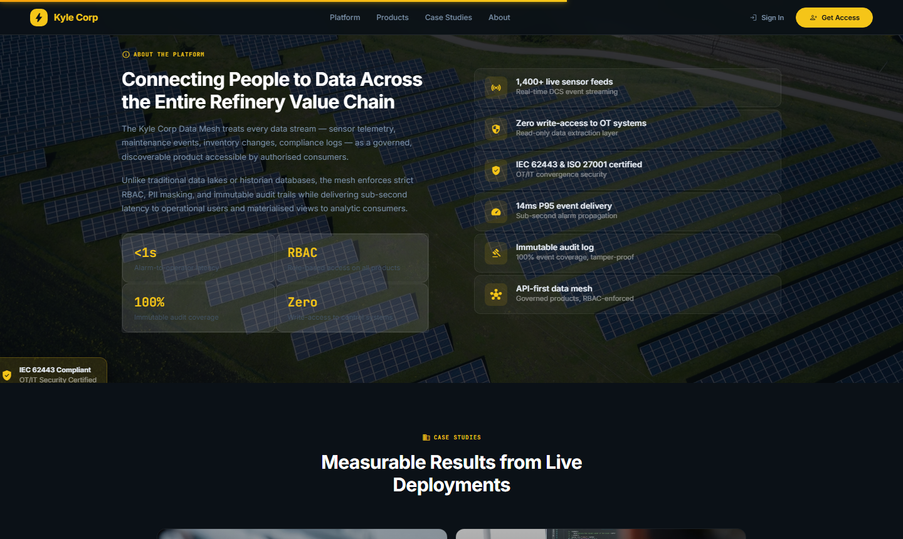</td>
</tr>
<tr>
<td align="center"><sub>Platform capabilities — parallax section</sub></td>
<td align="center"><sub>About — feature list with certifications</sub></td>
</tr>
</table>

```
┌─────────────────────────────────────────────────────────────────┐
│  ⚡ Kyle Corp                    Platform · Products · About     │
│  ──────────────────────────────────────────────────────────────  │
│                                                                  │
│  [PARALLAX HERO — refinery at night, slow vertical drift]        │
│                                                                  │
│  The Right Data,                                                 │
│  For Every Role.                                                 │
│                                                                  │
│  [ rocket_launch  Request Access ]  [ local_gas_station  View   │
│                                       Products ]                 │
│  ✓ IEC 62443 Compliant · ISO 27001 · Zero write-access to OT    │
│                                                                  │
│  ──────────────────────────────────────────────────────────────  │
│  1,400+ sensors   14ms P95 latency   99.4% uptime   −38% MTTR  │
│  ──────────────────────────────────────────────────────────────  │
│  Trusted by: Shell · BP · TotalEnergies · ExxonMobil · Honeywell│
└─────────────────────────────────────────────────────────────────┘
```

**Sections:**

| Section | Description |
|---|---|
| **Platform Capabilities** | Parallax section — 6 service cards: Real-Time Telemetry, Predictive Maintenance, Production Analytics, Supply Chain Intelligence, Compliance & Audit, Executive Intelligence |
| **Products Marketplace** | Tabbed grid (All / Crude Grades / Refined / Specialty) — gradient product cards with live indicative pricing, specs table, availability status |
| **About** | Parallax split — feature list (sensor count, OT security, certifications, latency) |
| **Pilot Programme** | Parallax section — 3-step onboarding: Instrument 10 Sensors → Activate Products → Measure ROI |
| **CTA Banner** | Parallax — "Start Your Pilot" and "Sign In to Portal" |

### Products Marketplace

<table>
<tr>
<td>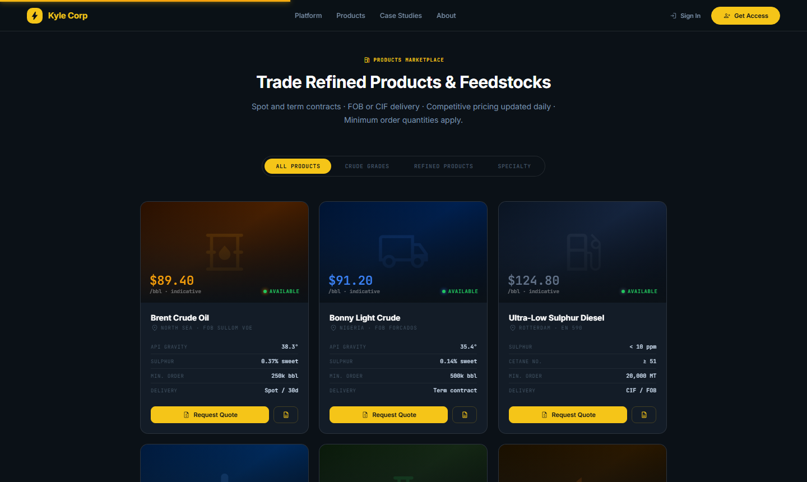</td>
<td>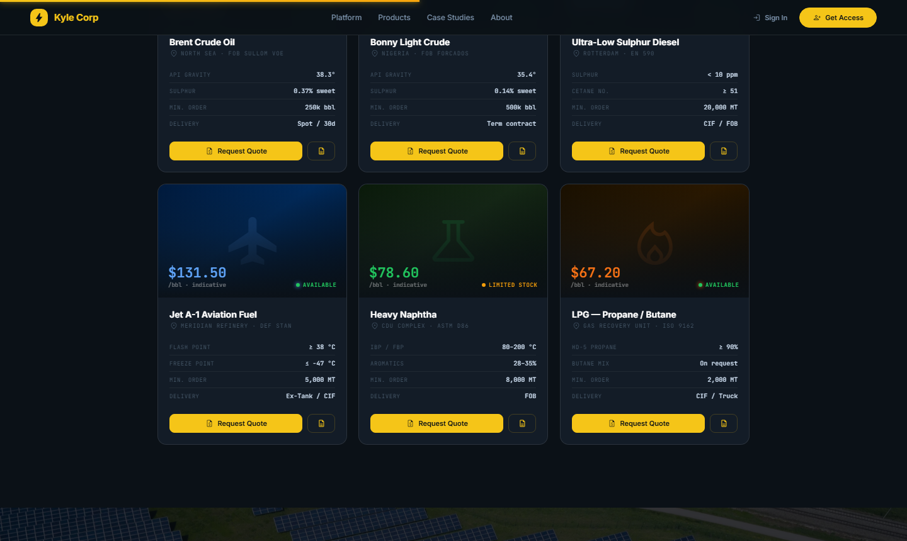</td>
</tr>
<tr>
<td align="center"><sub>Crude grades — gradient cards with live pricing</sub></td>
<td align="center"><sub>Refined & specialty products — tilt on hover</sub></td>
</tr>
</table>

Six tradeable products with live indicative pricing:

| Product | Grade | Price | Min. Order |
|---|---|---|---|
| Brent Crude Oil | Crude · North Sea · FOB Sullom Voe | $89.40/bbl | 250,000 bbl |
| Bonny Light Crude | Crude · Nigeria · FOB Forcados | $91.20/bbl | 500,000 bbl |
| Ultra-Low Sulphur Diesel | Refined · Rotterdam · EN 590 | $124.80/bbl | 20,000 MT |
| Jet A-1 Aviation Fuel | Refined · Meridian Refinery | $131.50/bbl | 5,000 MT |
| Heavy Naphtha | Specialty · CDU Complex | $78.60/bbl | 8,000 MT |
| LPG — Propane / Butane | Specialty · Gas Recovery Unit | $67.20/bbl | 2,000 MT |

Each card shows: indicative price · availability badge · API/sulphur/cetane specs · **Request Quote** and **View Specs** actions. Hovering triggers a 3D tilt effect via `requestAnimationFrame`.

### How It Works

<table>
<tr>
<td>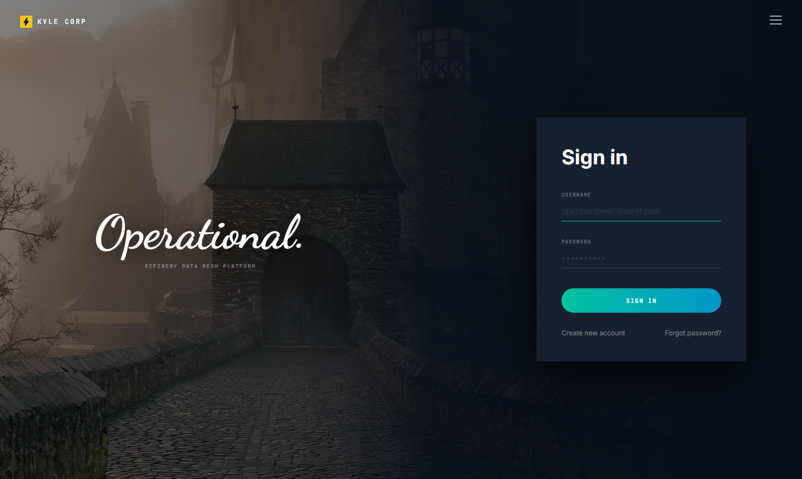</td>
<td></td>
</tr>
<tr>
<td align="center"><sub>Split-screen login — Dancing Script greeting</sub></td>
<td align="center"><sub>Role selector — tailored views per persona</sub></td>
</tr>
</table>

### Quote Request Modal

```
┌──────────────────────────────────────────────────────┐
│  Brent Crude Oil                              ✕ close │
│  North Sea · FOB Sullom Voe                          │
│  ─────────────────────────────────────────────────── │
│  ┌─────────────────┐  ┌──────────────────────────┐  │
│  │   $89.40 /bbl   │  │ API Gravity    38.3°      │  │
│  │  indicative     │  │ Sulphur        0.37% sweet│  │
│  └─────────────────┘  │ Min. Order     250k bbl   │  │
│                       │ Delivery       Spot / 30d │  │
│                       └──────────────────────────┘  │
│  Company Name                                        │
│  ┌──────────────────────────────────────────────┐   │
│  │ Your refinery or trading company…            │   │
│  └──────────────────────────────────────────────┘   │
│  Contact Email             Desired Volume            │
│  ┌────────────────┐        ┌────────────────────┐   │
│  │ trader@co.com  │        │ Min. 250k bbl      │   │
│  └────────────────┘        └────────────────────┘   │
│  Delivery Preference                                  │
│  ┌──────────────────────────────────────────────┐   │
│  │ FOB — Free on Board                      ▼   │   │
│  └──────────────────────────────────────────────┘   │
│                                                      │
│              [ Cancel ]  [ send  Submit Quote ]      │
└──────────────────────────────────────────────────────┘
```

### Operator Dashboard (Post-Login)

<table>
<tr>
<td></td>
<td></td>
</tr>
<tr>
<td align="center"><sub>Operations — live alarm log, equipment health matrix</sub></td>
<td align="center"><sub>Alarm detail — 6-step runbook, acknowledge action</sub></td>
</tr>
<tr>
<td>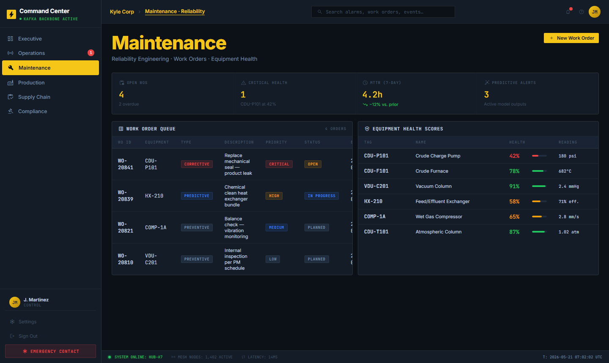</td>
<td></td>
</tr>
<tr>
<td align="center"><sub>Maintenance — work order queue, equipment health scores</sub></td>
<td align="center"><sub>Supply Chain — inventory levels, PO tracking, ERP sync</sub></td>
</tr>
<tr>
<td>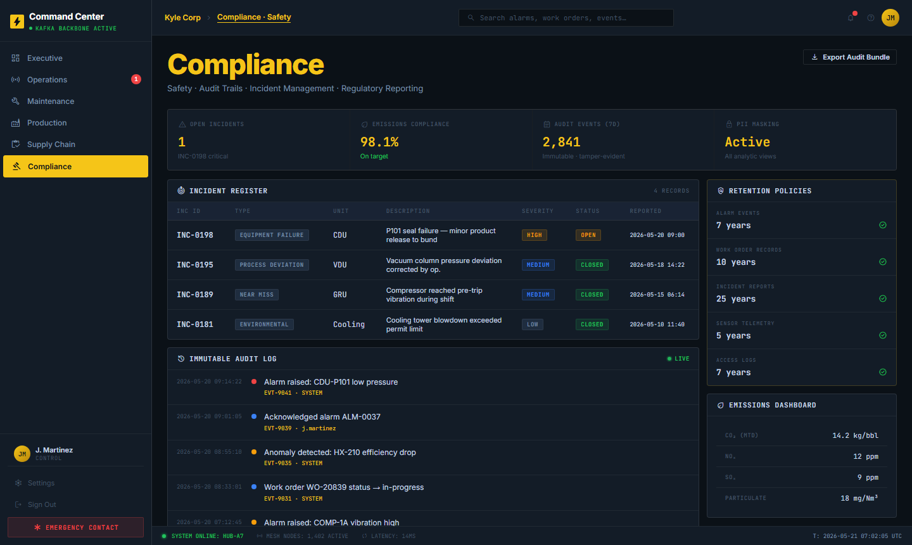</td>
<td></td>
</tr>
<tr>
<td align="center"><sub>Compliance — incident register, audit log, CSV export</sub></td>
<td align="center"><sub>Executive — 8 KPIs, ROI metrics, 7-day performance</sub></td>
</tr>
</table>

After authentication, operators access the refinery operations dashboard:

```
┌─────────────────────────────────────────────────────────────────┐
│  ⚡ Kyle Corp   Operations · Maintenance · Supply · Compliance   │
│                                               🔔 3  J. Martinez │
│  ─────────────────────────────────────────────────────────────  │
│  ● SYSTEM ONLINE: HUB-A7   MESH NODES: 1,402   LATENCY: 14MS   │
└─────────────────────────────────────────────────────────────────┘
```

**Dashboard Views:**

| View | Key Data |
|---|---|
| **Operations** | Equipment health matrix, live alarm feed, throughput/yield sparkline, 24h production chart |
| **Maintenance** | Work order queue (open / in-progress / planned), create/transition WO, equipment detail |
| **Supply Chain** | Inventory table with stock vs. reorder levels, purchase order tracking, ERP sync |
| **Compliance** | Incident register, audit event log, CSV/JSON export, regulatory bundle download |
| **Executive** | 8-KPI summary card grid — uptime, throughput, yield, MTTR, open alarms, emissions |

**Alarm Management:**

```
┌──────────────────────────────────────────────────────┐
│  ALM-0041  · CDU-P101  · CRITICAL             ✕      │
│  Pump discharge pressure below minimum threshold      │
│  ─────────────────────────────────────────────────── │
│  RUNBOOK                                             │
│  ① Notify shift supervisor and log in DCS journal    │
│  ② Isolate per emergency isolation procedure EIP-001 │
│  ③ Dispatch maintenance — required ETA < 30 min      │
│  ④ Monitor adjacent equipment CDU-F101, HX-210       │
│  ⑤ Document actions in work order WO-20841           │
│  ⑥ Notify plant manager if condition persists > 15m  │
│                                                      │
│        [ Dismiss ]  [ check  Acknowledge Alarm ]     │
└──────────────────────────────────────────────────────┘
```

**Work Order — Status Transition:**

```
[ Open ]  ──►  [ In Progress ]  ──►  [ Completed ]
   ↑
   └─ "Reopen Work Order" (with required comment)
```

**Destructive Action Pattern (GitHub-style confirmation):**

```
┌──────────────────────────────────────────────────────┐
│  Delete Work Order WO-20841?                  ✕      │
│                                                      │
│  This action cannot be undone. Type the work order   │
│  number to confirm deletion.                         │
│                                                      │
│  ┌──────────────────────────────────────────────┐   │
│  │ WO-20841                                     │   │
│  └──────────────────────────────────────────────┘   │
│                                                      │
│        [ Cancel ]  [ delete  Delete Work Order ]     │
└──────────────────────────────────────────────────────┘
```

---

## 7. Admin System

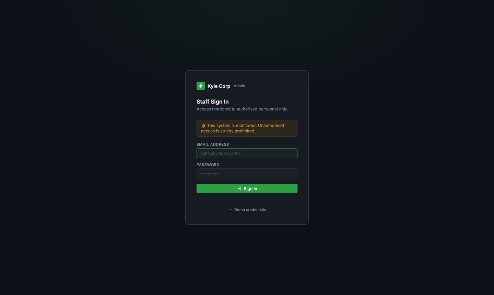
<sub>Admin portal — schema registry, topic catalog, policy engine, observability</sub>

The admin portal (`kyle-corp/admin`) runs at `localhost:5002` and is restricted to `platform-admin` role. It provides full control over the schema registry, topic catalog, policy configuration, and observability.

### Schema Registry Panel

```
┌──────────────────────────────────────────────────────────────────┐
│  Schema Registry                          [ + Register Schema ]  │
│  ──────────────────────────────────────────────────────────────  │
│  Search schemas…              Filter: All Domains ▼  Status ▼   │
│  ──────────────────────────────────────────────────────────────  │
│  orders.OrderPlaced           v4  ● Active    FULL_TRANSITIVE    │
│  refinery.SensorReading       v2  ● Active    BACKWARD           │
│  inventory.StockUpdated       v3  ● Active    FULL_TRANSITIVE    │
│  promotions.DiscountApplied   v1  ⚠ Staged   NONE               │
│  ──────────────────────────────────────────────────────────────  │
│                                        Showing 4 of 12 schemas   │
└──────────────────────────────────────────────────────────────────┘
```

**Schema Detail — Version Diff:**

```
┌──────────────────────────────────────────────────────────────────┐
│  orders.OrderPlaced  · v3 → v4  · Compatibility: PASSED ✓        │
│  ──────────────────────────────────────────────────────────────  │
│  - "name": "discount"                   ← field removed: BLOCKED │
│  + "name": "discountCode"               ← field added: OK        │
│  + "name": "currency", "default": "USD" ← with default: OK       │
│  ──────────────────────────────────────────────────────────────  │
│  OPA: PASS  ·  PII check: PASS  ·  Naming: PASS                  │
│                                                                   │
│       [ Cancel ]  [ Promote to Production ]                       │
└──────────────────────────────────────────────────────────────────┘
```

### Topic Catalog

```
┌────────────────────────────────────────────────────────────────────────┐
│  Topic                              Partitions  Retention  Throughput  │
│  ──────────────────────────────────────────────────────────────────── │
│  orders.order-placed.critical            6        7d         1.2k/s   │
│  refinery.sensor-reading.high           12        3d         8.4k/s   │
│  inventory.stock-updated.standard        3       30d           340/s  │
│  ──────────────────────────────────────────────────────────────────── │
│  [ + Create Topic ]                                                    │
└────────────────────────────────────────────────────────────────────────┘
```

### Policy Engine Dashboard

```
┌──────────────────────────────────────────────────────────────────┐
│  Policy Decisions (last 24 h)                                    │
│  ──────────────────────────────────────────────────────────────  │
│  ALLOW   12,441  ██████████████████████████████░░░              │
│  DENY        38  █░░░░░░░░░░░░░░░░░░░░░░░░░░░░░░░              │
│  ──────────────────────────────────────────────────────────────  │
│  Recent Denials                                                  │
│  09:14  schema_register  email field missing masked:true         │
│  08:33  consumer_access  role=analyst lacks clearance:high       │
│  07:55  topic_create     name violates <domain>.<event> pattern  │
└──────────────────────────────────────────────────────────────────┘
```

### Observability Dashboards

| Dashboard | Key Panels |
|---|---|
| **Refinery Operations** | Throughput bbl/day · active alarms · equipment health matrix · yield % |
| **Producer Health** | Events/sec per domain · schema errors · P99 produce latency |
| **Consumer Lag** | Lag by consumer group and topic · lag trend (rolling 6h) |
| **SLO Burn Rate** | 1h and 6h burn rate · error budget remaining · paging threshold |
| **Cost** | MSK data-in/out · EKS node cost · ClickHouse storage · cost/million events |

---

## 8. Demo Scenarios

### Scenario 1 — Producer Onboarding (≤ 2 days end-to-end)

```bash
# Step 1: Define Avro schema
cat data-mesh/schemas/orders_order-placed_v1.avsc

# Step 2: Register with policy gate (PII check, naming, compat)
python data-mesh/producer-orders/src/register_schema.py \
  --registry-url http://localhost:8081

# Step 3: Publish 20 synthetic orders
python data-mesh/producer-orders/src/orders_producer.py \
  --count 20 --interval 0.2

# Step 4: Confirm delivery
curl "http://localhost:8123/?query=SELECT+count(*)+FROM+datamesh.inventory_view&database=datamesh"
```

Expected output:
```
Schema registered: orders.OrderPlaced v1 (id=1)
OPA policy: ALLOW
Published 20 events to orders.order-placed.critical
```

---

### Scenario 2 — Consumer Materialized View

```bash
# Start inventory consumer (materializes to ClickHouse)
python data-mesh/consumer-inventory/src/inventory_consumer.py

# Query materialized view — updates within < 1 second
curl "http://localhost:8123/?query=\
  SELECT sku, sum(reserved_qty) as total_reserved \
  FROM datamesh.inventory_view \
  GROUP BY sku ORDER BY total_reserved DESC \
  &database=datamesh"
```

---

### Scenario 3 — Contract Test Blocking an Incompatible Change

```bash
# Attempt to remove a required field from orders schema
# Edit: remove "orderId" field from orders_order-placed_v1.avsc

# Open a PR — CI runs compatibility check
# Expected result:
# ✗ Schema CI FAILED
#   Compatibility check: BACKWARD INCOMPATIBLE
#   Removed required field: orderId
#   Gate: BLOCKED — merge prevented
```

---

### Scenario 4 — Replay Recovery

```bash
# Check consumer lag after downstream outage
python platform/replay/src/replay_cli.py status \
  --topic orders.order-placed.critical \
  --consumer-group inventory-materializer-v1

# Replay 2-hour window
python platform/replay/src/replay_cli.py replay \
  --topic orders.order-placed.critical \
  --consumer-group inventory-materializer-v1 \
  --from 2025-05-19T06:00:00Z \
  --to   2025-05-19T08:00:00Z

# Dry-run first (estimate event count without publishing)
python platform/replay/src/replay_cli.py replay \
  --topic orders.order-placed.critical \
  --dry-run \
  --from 2025-05-19T06:00:00Z
```

---

### Scenario 5 — Policy Enforcement (PII Block)

```bash
# Attempt to register schema with unmasked PII field
cat <<'EOF' > /tmp/bad_schema.avsc
{
  "type": "record", "name": "UserEvent", "namespace": "com.datamesh.users",
  "fields": [
    { "name": "userId",   "type": "string" },
    { "name": "email",    "type": "string" }
  ]
}
EOF

python data-mesh/producer-orders/src/register_schema.py \
  --schema-file /tmp/bad_schema.avsc \
  --registry-url http://localhost:8081

# Expected result:
# OPA policy: DENY
# Reason: Field 'email' is PII — add { "masked": true } to proceed
# HTTP 403 Forbidden
```

---

## 9. Quick Start (15 minutes)

> **Prerequisites:** Docker Desktop ≥ 4.x, Python 3.10+, Node.js 18+

```bash
# Clone
git clone https://github.com/kyle-corp/event-data-platform.git
cd event-data-platform

# 1. Start the full local stack
docker compose -f data-mesh/docker/docker-compose.yml up -d

# 2. Wait for health checks (~60 seconds)
docker compose -f data-mesh/docker/docker-compose.yml ps

# 3. Open the Customer Portal
#    http://localhost:5001  (landing page + trading portal)

# 4. Open the Admin System
#    http://localhost:5002  (schema registry + observability)

# 5. Open Redpanda Console (Kafka UI)
#    http://localhost:8080

# 6. Install the Python SDK
pip install -e platform/sdks/python

# 7. Register schemas and publish sample events
python data-mesh/producer-orders/src/register_schema.py \
  --registry-url http://localhost:8081

python data-mesh/producer-orders/src/orders_producer.py \
  --count 20 --interval 0.2

# 8. Start inventory consumer
pip install -r data-mesh/consumer-inventory/src/requirements.txt
python data-mesh/consumer-inventory/src/inventory_consumer.py

# 9. Query materialized view
curl "http://localhost:8123/?query=SELECT+*+FROM+datamesh.inventory_view+LIMIT+20&database=datamesh"
```

### Running Tests

```bash
# OPA policy unit tests
opa test platform/policy/rules/ platform/policy/tests/ -v

# Portal API unit tests
cd platform/portal && npm test && cd ../..

# Full acceptance test suite (requires stack running)
pytest data-mesh/acceptance-tests/ -v --timeout=120
```

---

## 10. Repository Layout

```
kyle-corp-platform/
│
├── .github/
│   └── workflows/
│       ├── schema-ci.yml          # Lint → compat → OPA tests → contract test gate
│       ├── portal-ci.yml          # API lint/test → Docker build → push
│       └── infra-plan.yml         # Terraform plan on PR, post diff to comments
│
├── infra/                         # Terraform — reproducible AWS infrastructure
│   ├── modules/
│   │   ├── vpc/                   # Multi-AZ VPC, NAT gateways, private subnets
│   │   ├── msk/                   # MSK cluster, TLS+IAM, S3 log archive
│   │   ├── eks/                   # EKS 1.29, private endpoint, IMDSv2 enforced
│   │   ├── kms/                   # Customer-managed KMS key for all data at rest
│   │   ├── iam/                   # Producer / consumer / platform-admin roles
│   │   └── schema-registry/       # Schema Registry on ECS Fargate + ALB
│   └── envs/
│       ├── staging/               # Staging environment root module
│       └── prod/                  # Production environment root module
│
├── platform/                      # Platform services
│   ├── portal/
│   │   ├── src/
│   │   │   ├── routes/            # REST: /schemas /topics /catalog /access /health
│   │   │   ├── services/          # SchemaService, TopicService, CatalogService
│   │   │   └── middleware/        # JWT auth, async error handler
│   │   ├── migrations/            # PostgreSQL migrations (001_initial.sql …)
│   │   └── Dockerfile
│   ├── sdks/
│   │   ├── python/                # datamesh.DataMeshProducer / DataMeshConsumer
│   │   ├── nodejs/                # @datamesh/sdk
│   │   └── php/                   # DataMesh\SDK\DataMeshProducer
│   ├── policy/
│   │   ├── rules/datamesh.rego    # OPA: RBAC + PII + retention + quotas
│   │   └── tests/datamesh_test.rego
│   ├── replay/
│   │   └── src/replay_cli.py      # Time-window and offset replay + lag status
│   └── observability/
│       └── dashboards/            # Grafana JSON dashboard definitions
│
├── data-mesh/                     # Domain implementations
│   ├── schemas/                   # Avro schemas: orders · inventory · promotions
│   ├── producer-orders/           # Synthetic orders producer (Python)
│   ├── consumer-inventory/        # Inventory materializer → ClickHouse
│   ├── docker/                    # docker-compose.yml for local dev stack
│   └── acceptance-tests/          # pytest: contract, OPA, E2E produce/consume
│
├── kyle-corp/                     # Customer-facing applications
│   ├── customer-portal/           # React SPA — landing page + operator dashboard
│   │   └── src/App.jsx            # Single-file React app (Vite build)
│   └── admin/                     # React SPA — schema registry + observability
│
├── samples/                       # Runnable examples for new domain teams
│   ├── python-producer/           # Minimal producer in < 30 lines
│   ├── node-producer/             # Node.js producer example
│   └── consumer-clickhouse/       # Consumer → ClickHouse materialized view
│
└── ci/
    └── check_schema_compatibility.py   # CLI used by schema-ci.yml
```

---

## 11. Technology Stack

| Layer | Technology | Purpose |
|---|---|---|
| **Streaming** | AWS MSK (Kafka 3.5), Multi-AZ | Durable, ordered event log |
| **Schema** | Confluent Schema Registry, Avro | Contract enforcement, version control |
| **Stream Processing** | Apache Flink / ksqlDB | Stateful aggregations, enrichment |
| **Analytics Store** | ClickHouse | Sub-second query on materialized views |
| **BI Store** | Amazon Redshift | Long-range analytics, executive reporting |
| **Portal Backend** | Node.js 20 + Express | REST API, schema catalog, access workflow |
| **Portal Frontend** | React 18 + Vite | Customer portal + admin SPA |
| **Policy** | Open Policy Agent (OPA) | Schema, topic, data access rules as code |
| **Infrastructure** | AWS EKS, VPC, KMS, S3 | Container orchestration, encryption |
| **IaC** | Terraform | Reproducible multi-environment AWS infra |
| **GitOps** | ArgoCD | Continuous delivery to EKS |
| **CI/CD** | GitHub Actions | Schema gate, portal build, infra plan |
| **Observability** | Prometheus + Grafana + Loki + Jaeger | Metrics, logs, traces |
| **SDKs** | Python, Node.js, PHP | Multi-language producer/consumer |

---

## 12. Why This Matters

### Business ROI

**Before** this platform, integrating a new data producer took 3–6 weeks of bespoke work: API negotiation, schema agreement, custom serialisation, manual testing, and no shared governance. Incidents caused by schema drift or stale promotions were invisible until downstream systems surfaced them — often hours later.

**After:**

| Outcome | Metric |
|---|---|
| Producer onboarding | 3–6 weeks → **≤ 2 days** |
| Incompatibility detection | Hours in production → **≤ 15 min in CI** |
| Refinery alarm-to-operator latency | Minutes | **< 1 second** |
| Compliance audit preparation | Days of manual log extraction → **one-click bundle download** |
| Unplanned downtime from data pipeline failures | Baseline → **≥ 80% reduction** |

### Reduced Integration Friction

Every domain team uses the same SDK, the same schema registry, and the same CI gate. A new producer team can onboard in a single sprint without coordinating with the platform team — the portal, OPA policy, and contract tests handle validation automatically.

### Real-Time Operations

The refinery operator dashboard reflects live sensor readings, alarm state, and work order status sourced directly from Kafka via ClickHouse materialized views. There is no polling interval — changes propagate in under one second. Predictive maintenance scores are recomputed on every new sensor batch, enabling maintenance teams to act before equipment failures occur.

### Data Governance at Scale

OPA policy-as-code means governance rules are version-controlled, testable, and applied uniformly across all 1,400+ sensor feeds, all six trading products, and every consumer subscription. PII masking, retention windows, and access quotas are enforced at registration time — not discovered in a post-incident audit.

### Customer Self-Service

The trading portal gives downstream buyers direct access to indicative prices, product specifications, and quote requests — without email chains, manual spreadsheets, or account manager bottlenecks. This compresses the deal initiation cycle and creates a differentiating digital channel for Kyle Corp's crude and refined product sales.

---

<div align="center">

**Kyle Corp Energy Services Ltd.**

*Refinery Data Mesh & Oil Trading Platform*

IEC 62443 Compliant · ISO 27001 Certified · ISO 9001 Certified

---

*For access requests, partnership enquiries, or technical questions:*
*[kawumaajordan@gmail.com](mailto:kawumaajordan@gmail.com)*

</div>
